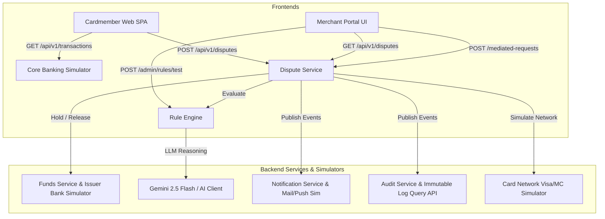

# Complete End-to-End Implementation Plan for Dispute Resolution Platform

This implementation plan details the exact architectural components, endpoints, microservices, and simulator layers required to complete the **Dispute Resolution Platform (GCH-VR)** in accordance with [system-architecture.md](file:///c:/Users/c9014/OneDrive/Documents/GCH-VR/system-architecture.md) and [deep-research-report.md](file:///c:/Users/c9014/OneDrive/Documents/GCH-VR/deep-research-report.md) with **zero gaps**.

---

## Architecture Gap Matrix & Fulfillment Strategy



---

## User Review Required

> [!IMPORTANT]
> **Simulators vs. External APIs**: As confirmed, actual third-party payment gateways (Visa VROL, Mastercard MCOM, banking core systems, real SendGrid/Firebase) will be implemented as **in-system simulation adapters** (`services/funds_service/app/simulators.py` and `services/common/simulators.py`). These will simulate chargeback hold locks, issuer ledger entries, Visa/Mastercard collaboration alerts, and simulated email/push dispatches.

---

## Proposed Changes

### 1. Common Layer & Database Model Updates
> **Goal**: Update schemas, add transaction feed structures, fix `datetime.utcnow()` deprecations, and implement audit query helpers.

#### [MODIFY] [schemas.py](file:///c:/Users/c9014/OneDrive/Documents/GCH-VR/services/common/schemas.py)
- Add `TransactionRecord` schema for cardmember account transaction history.
- Add `NotificationRecord` schema for sent emails/push messages.
- Add `AuditEventQuery` and response models.
- Replace `datetime.utcnow()` with `datetime.now(timezone.utc)` across all models.

#### [MODIFY] [database.py](file:///c:/Users/c9014/OneDrive/Documents/GCH-VR/services/common/database.py)
- Replace `datetime.utcnow()` with `datetime.now(timezone.utc)`.
- Add `transactions`, `notifications`, and `audit_logs` collections to `STORE`.
- Seed 5 realistic posted credit card transactions for Cardmember `00000000-0000-0000-0000-000000000001` (TechStore Online $149.99, Sneaker World $210.00, Unknown Vendor NYC $89.50, Airline Tickets $450.00, Coffee Shop $4.75).

---

### 2. Banking & Card Network Simulators (`funds_service`)
> **Goal**: Build realistic Issuer Core Banking and Visa/Mastercard Network chargeback collaboration simulators.

#### [NEW] [simulators.py](file:///c:/Users/c9014/OneDrive/Documents/GCH-VR/services/funds_service/app/simulators.py)
- `IssuerBankingSimulator`: Simulates provisional credit issuance, cardmember balance holds, and merchant account reserve holds.
- `CardNetworkSimulator`: Simulates Visa Claims Resolution (VCR) & Mastercard Collaboration stage inquiry alerts, representment windows, and network fee calculations.

#### [MODIFY] [routes.py](file:///c:/Users/c9014/OneDrive/Documents/GCH-VR/services/funds_service/app/routes.py)
- Connect `/internal/v1/funds/hold` and `/release` to `IssuerBankingSimulator`.
- Expose `/api/v1/simulators/card-network` for triggering network collaboration alerts and representment simulation events.

---

### 3. Core Banking Transaction Feed API
> **Goal**: Expose `/api/v1/transactions` for cardmembers to view posted charges and initiate disputes directly from their bank feed.

#### [NEW] [routes_transactions.py](file:///c:/Users/c9014/OneDrive/Documents/GCH-VR/services/dispute_service/app/routes_transactions.py)
- Implement `GET /api/v1/transactions`: Returns paginated posted transactions for the authenticated cardmember, with active dispute links.

#### [MODIFY] [main.py](file:///c:/Users/c9014/OneDrive/Documents/GCH-VR/services/dispute_service/main.py)
- Mount `routes_transactions.py` router.

---

### 4. Notification Service & Simulator
> **Goal**: Implement full notification subscriber and query APIs for emails & push notifications.

#### [NEW] [routes.py](file:///c:/Users/c9014/OneDrive/Documents/GCH-VR/services/notification_service/app/routes.py)
- Implement `GET /api/v1/notifications`: List all triggered email/push notifications by user or dispute ID.

#### [MODIFY] [subscribers.py](file:///c:/Users/c9014/OneDrive/Documents/GCH-VR/services/notification_service/app/subscribers.py)
- Implement rich event-driven notification handlers for `DISPUTE_FILED`, `EVIDENCE_SUBMITTED`, `MEDIATED_REQUEST_CREATED`, `VERDICT_ISSUED`, `APPEAL_FILED`, and `APPEAL_DECIDED`.
- Format simulated HTML/text email content (SendGrid format) and push payloads (FCM format) stored in `STORE.notifications`.

#### [MODIFY] [main.py](file:///c:/Users/c9014/OneDrive/Documents/GCH-VR/services/notification_service/main.py)
- Include CORS middleware and mount `routes.py` router.

---

### 5. Audit Service & Query API
> **Goal**: Build immutable audit logging query API and SHA-256 payload verification.

#### [NEW] [routes.py](file:///c:/Users/c9014/OneDrive/Documents/GCH-VR/services/audit_service/app/routes.py)
- Implement `GET /api/v1/audit-logs`: Query tamper-evident audit logs filtered by `dispute_id`, `actor_id`, or `action_type`.

#### [MODIFY] [subscribers.py](file:///c:/Users/c9014/OneDrive/Documents/GCH-VR/services/audit_service/app/subscribers.py)
- Calculate SHA-256 hash signatures for all audit payloads and store immutable records in `STORE.audit_logs`.

#### [MODIFY] [main.py](file:///c:/Users/c9014/OneDrive/Documents/GCH-VR/services/audit_service/main.py)
- Include CORS middleware and mount `routes.py` router.

---

### 6. Gemini 2.5 Flash AI Reasoning & Document AI Integration
> **Goal**: Enhance AI client fallback with `google-genai` SDK support or structured LLM reasoning for edge-case resolution and plain-language explanation generation.

#### [MODIFY] [gemini_client.py](file:///c:/Users/c9014/OneDrive/Documents/GCH-VR/services/rule_engine/app/gemini_client.py)
- Add optional live `google-genai` client invocation when `GEMINI_API_KEY` is present.
- Enhance local reasoning prompt evaluator with natural plain-language verdict generators matching `deep-research-report.md`.

#### [MODIFY] [docai.py](file:///c:/Users/c9014/OneDrive/Documents/GCH-VR/services/evidence_service/app/docai.py)
- Expand mock OCR parser to extract tracking numbers, carrier names, delivery timestamps, item lists, and delivery zip codes from uploaded PDF/image files.

---

### 7. Frontend Integration Updates (`cardmember-web` & `merchant-portal`)

#### [MODIFY] [client.ts](file:///c:/Users/c9014/OneDrive/Documents/GCH-VR/frontend/cardmember-web/src/api/client.ts)
- Add `fetchTransactions()` API call pointing to `GET /api/v1/transactions`.

#### [MODIFY] [TransactionHistory.tsx](file:///c:/Users/c9014/OneDrive/Documents/GCH-VR/frontend/cardmember-web/src/pages/TransactionHistory.tsx)
- Replace static `mockTransactions` array with dynamic API call to `fetchTransactions()`.

#### [MODIFY] [DisputeDetail.tsx](file:///c:/Users/c9014/OneDrive/Documents/GCH-VR/frontend/cardmember-web/src/pages/DisputeDetail.tsx)
- Add download link preview widget for uploaded evidence files using `GET /api/v1/evidence/{id}/download`.
- Add notification drawer/banner showing simulated emails/push alerts received for the dispute.

---

## Verification Plan

### Automated Tests
1. Run pytest suite across all backend services:
   ```bash
   pytest
   ```
2. Run end-to-end blackbox lifecycle integration test:
   ```bash
   python scripts/run_demo_suite.py
   ```

### Manual Verification
1. Open Cardmember Web (`http://localhost:5173`) -> View dynamic transaction history loaded from `/api/v1/transactions` -> File dispute -> Upload tracking evidence -> Verify provisional hold simulation.
2. Open Merchant Portal (`http://localhost:5174`) -> Inspect dispute -> Propose mediated clarification request -> Respond as Cardmember -> Run visual rule builder dry-run test -> Issue verdict -> File appeal -> Verify simulated AI secondary review outcome.
