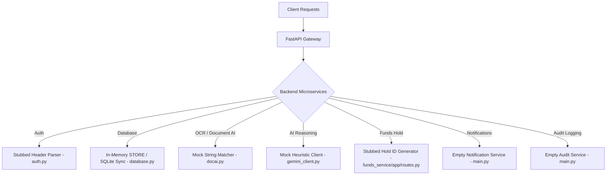

# Comprehensive Project Audit & Analysis Report

> **Project**: Dispute Resolution Platform (GCH-VR)  
> **Date**: July 23, 2026  
> **Scope**: End-to-End Codebase Review, Microservices Architecture Alignment, API Contracts, Mocks Audit, Security & SDK Health  

---

## Executive Summary

A complete line-by-line audit of the **Dispute Resolution Platform (DRP)** was conducted across all documentation, all 6 backend microservices (`dispute_service`, `evidence_service`, `funds_service`, `rule_engine`, `notification_service`, `audit_service`), shared common libraries, database layer, frontend web apps (`cardmember-web` and `merchant-portal`), and automated test suites.

Overall, the core state machine, API endpoints, rule engine dry-running, evidence parsing, and fundamental dispute lifecycles are **functional and pass automated tests (9/9 passed)**. However, there are significant structural gaps between the **theoretical multi-service architecture documents** and the **actual runtime codebase**, including skeleton services with zero routes, widespread mock implementations for AI/GCP services, hardcoded transaction feeds in the frontend, in-memory data store reliance, and authentication simplifications.

---

## 1. Complete Microservice & Subsystem Breakdown

| Microservice / Subsystem | Lines of Code / Status | Key Findings & Gaps | Impact |
|---|---|---|---|
| **Dispute Service** (`services/dispute_service`) | ~400 LOC / 🟡 Partial | Main API router working for CRUD, state machine, timeline, appeals, and mediated requests. Relies on shared in-memory `STORE` object. | **Medium** |
| **Notification Service** (`services/notification_service`) | 14 LOC / 🔴 Skeleton | `main.py` is only 6 lines (`FastAPI()`) with **zero HTTP routes**. `app/subscribers.py` only appends event dicts to an in-memory Python list. No email/SMS sending or WebSocket implementation. | **High** |
| **Audit Service** (`services/audit_service`) | 12 LOC / 🔴 Skeleton | `main.py` is 6 lines with **zero HTTP routes** or query endpoints. Events are not persisted to a immutable audit log database or GCP Cloud Logging. | **High** |
| **Funds Service** (`services/funds_service`) | 63 LOC / 🟡 Stubbed | Implements `/internal/v1/funds/hold` and `/release`. Returns a static hardcoded hold reference `HOLD_STUB_VISA_88291` without banking/card network API integration. | **Medium** |
| **Evidence Service** (`services/evidence_service`) | ~80 LOC / 🟡 Mocked | Functional file upload endpoint, but uses heuristic string regex matching instead of Document AI OCR API, and dummy `gs://` URIs instead of Google Cloud Storage API. | **Medium** |
| **Rule Engine** (`services/rule_engine`) | ~250 LOC / 🟡 Fallback Mock | Admin rule set endpoints and rule condition evaluator work correctly. Fallback reasoning uses static regex/if-else checks instead of invoking the `google-genai` SDK for Gemini 2.5 Flash. | **Medium** |
| **Common Layer** (`services/common`) | ~500 LOC / 🟡 In-Memory | Shared schemas, auth, and database layer. Uses in-memory `STORE` dictionary synced to SQLite (`drp.db`) instead of PostgreSQL ORM engine. | **High** |

---

## 2. Documentation vs. Codebase Inconsistencies

| Component / Area | Documented Spec (`*.md`) | Actual Codebase Implementation | Impact & Severity |
|---|---|---|---|
| **Database Engine** | PostgreSQL with Alembic migrations (`database-design.md`) | In-memory Python `STORE` instance serialized to SQLite (`drp.db` via `services/common/database.py`) | **High** — DB migration files exist (`001_initial_schema.sql`), but runtime endpoints mutate an in-memory dictionary. |
| **Authentication & RBAC** | Firebase Auth JWT decoded at Cloud Endpoints ESPv2 (`api-reference.md` Section 2) | Custom header parser `X-Endpoint-API-UserInfo` parsing string format `role=CARDMEMBER;user_id=...` (`services/common/auth.py`) | **High** — Authentication relies on client-supplied claims without JWT signature validation or public key verification. |
| **Microservice Topology** | Decoupled Cloud Run microservices communicating via HTTP/gRPC & VPC Connectors (`system-architecture.md`) | Single Python process shared imports. Services share the exact same `STORE` object in memory (`services/common/database.py`) | **Medium** — Services are organized into separate folders but execute in a single monolithic python process. |
| **Document AI OCR** | Google Cloud Document AI OCR processor (`backend-design.md` Section 4) | Stubbed heuristic function `parse_document()` using pattern matching on raw binary/strings (`services/evidence_service/app/docai.py`) | **Medium** — Does not invoke GCP Document AI client library or GCP Cloud Storage API. |
| **Gemini 2.5 Flash Reasoning** | Live Gemini 2.5 Flash LLM call via Google GenAI SDK (`system-architecture.md`) | Hardcoded conditional fallback class `GeminiReasoningClient` (`services/rule_engine/app/gemini_client.py`) | **Medium** — Simulates verdict responses without executing real network calls to Gemini endpoints. |

---

## 3. Frontend & Backend Communication & Contract Audit

### 3.1 Cardmember Web (`frontend/cardmember-web`)
- **Transaction History Page (`TransactionHistory.tsx`)**:
  - ⚠️ **Mock Data Gap**: The transaction list relies on a hardcoded array `mockTransactions` containing 3 static charges (`TechStore Online`, `Sneaker World`, `Unknown Vendor NYC`). There is no backend endpoint for fetching cardmember transaction feeds.
  - 🟢 **Dispute Integration**: Connects to `/api/v1/disputes` to check active disputes and load status indicators.
- **Dispute Wizard (`DisputeWizard.tsx`) & Detail (`DisputeDetail.tsx`)**:
  - 🟢 **API Compliance**: Interfaces with `POST /api/v1/disputes`, `POST /api/v1/disputes/{id}/evidence`, `GET /api/v1/disputes/{id}/timeline`, and `POST /api/v1/disputes/{id}/mediated-requests/{requestId}/respond`.
  - ⚠️ **Missing Feature**: File upload in `DisputeDetail.tsx` currently uploads binary files, but GCS signed URL downloading link rendering is missing from the UI view.

### 3.2 Merchant Portal (`frontend/merchant-portal`)
- **Dispute Dashboard & Review (`DisputesDashboard.tsx`, `DisputeReview.tsx`)**:
  - 🟢 **API Alignment**: Uses `getMerchantClient()` with properly formatted `X-Endpoint-API-UserInfo` header (`role=MERCHANT`). Interacts with evidence upload and mediated clarification requests.
- **Rule Authoring & Visual Builder (`AdminRules.tsx`)**:
  - 🟢 **Rule Engine API**: Fully mapped to `GET /api/v1/admin/rules/{category}`, `POST /api/v1/admin/rules/{category}/test`, and `PUT /api/v1/admin/rules/{category}`. Dry-run JSON payload format matches backend expectations.
- **Reviewer Queue (`AdminAppeals.tsx`)**:
  - 🟢 **Appeals Workflow**: Properly sends `appeal_outcome` (`UPHELD` / `OVERTURNED`) to backend review endpoints.

---

## 4. Mocks, Stubs & Fake Flow Inventory

The following diagram details all non-production mocks and placeholder flows discovered in the codebase:

1. **Transaction Feed (`TransactionHistory.tsx`)**: `mockTransactions` static array.
2. **Notification Service (`services/notification_service/main.py`)**: Skeleton FastAPI app with no routes or mailers.
3. **Audit Service (`services/audit_service/main.py`)**: Skeleton FastAPI app with no query endpoints.
4. **Document AI Parsing (`services/evidence_service/app/docai.py`)**: Extracts OCR text via simple text string regex matches instead of Document AI API.
5. **Gemini AI Reasoning Client (`services/rule_engine/app/gemini_client.py`)**: `evaluate_dispute_fallback` returns mock `GeminiVerdictSchema` objects based on string checks (`"delivery_status" == "DELIVERED"` or `"zip code mismatch"`).
6. **Funds Service Holds (`services/funds_service/app/routes.py`)**: Generates mock hold references (`HOLD_STUB_VISA_88291`) without contacting real payment processor APIs.
7. **GCS Cloud Storage (`services/evidence_service/app/storage.py`)**: Generates dummy `gs://` URIs and stubbed download URLs without uploading to GCP Cloud Storage.

---

## 5. Security, Deprecation & SDK Health Assessment

### 5.1 Security Vulnerabilities & Risk Items
- ⚠️ **Unauthenticated Header Trust**: `services/common/auth.py` trusts the `X-Endpoint-API-UserInfo` header directly. In production without Cloud Endpoints ESPv2 stripping/overwriting this header, any client can spoof any `user_id` or `role` (e.g. set `role=ADMIN`).
- ⚠️ **CORS Wildcard Policy**: `CORSMiddleware` in FastAPI services sets `allow_origins=["*"]` with `allow_credentials=True`.
- 🟢 **PAN Sanitization**: Proper checks exist for detecting raw 16-digit Primary Account Numbers (`RAW_PAN_DETECTED` error code) in descriptions and evidence payloads.

### 5.2 SDK & Python Deprecations
- ⚠️ **`datetime.utcnow()` Deprecation**:
  - **Issue**: Python 3.12 deprecates `datetime.utcnow()` in favor of `datetime.now(timezone.utc)`.
  - **Impact**: Generates **103 deprecation warnings** during `pytest` runs across `database.py` and Pydantic models.
- 🟢 **Pydantic v2**: Pydantic v2 schemas (`model_dump()`) are used correctly throughout `common/schemas.py`.

---

## 6. Actionable Implementation Roadmap

1. **Implement Notification & Audit Service APIs**:
   - Build endpoints for querying audit logs in `services/audit_service/main.py`.
   - Wire email/push notification handlers in `services/notification_service/main.py`.
2. **Database Migration to PostgreSQL**: Connect SQLAlchemy engine to real PostgreSQL instance using `migrations/versions/001_initial_schema.sql` instead of the in-memory `STORE` object.
3. **Firebase Auth Verification**: Implement standard Firebase Admin SDK token verification in `services/common/auth.py` to decode and verify JWT signatures.
4. **Replace Mock SDKs with Live Integrations**:
   - Wire `google-genai` SDK in `gemini_client.py` for real Gemini 2.5 Flash reasoning.
   - Wire `google-cloud-documentai` in `docai.py` for real OCR processing.
5. **Fix Deprecation Warnings**: Update `datetime.utcnow()` calls to `datetime.now(timezone.utc)` across `services/common/database.py`.
6. **Backend Transaction API**: Create a `/api/v1/transactions` endpoint so `TransactionHistory.tsx` loads real transaction records from the backend.
