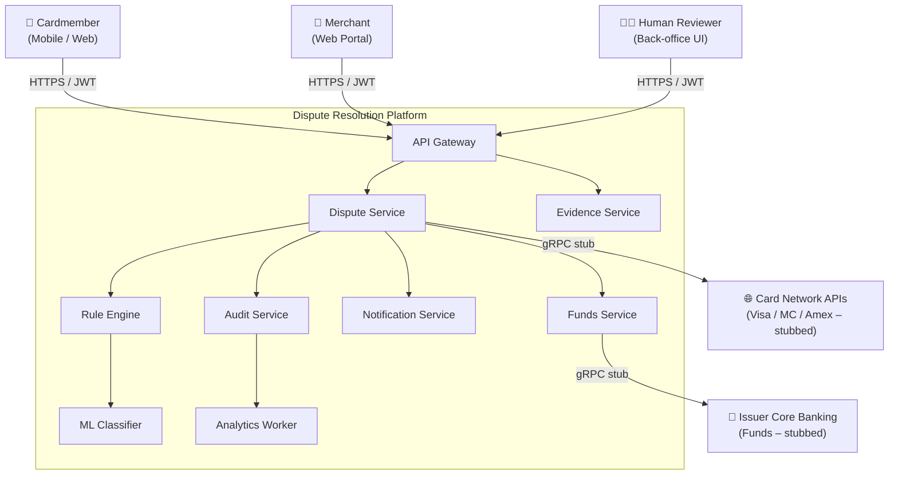
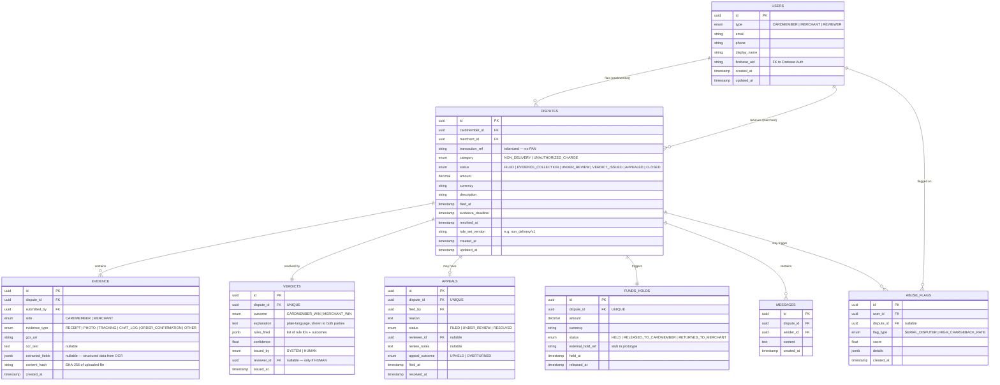
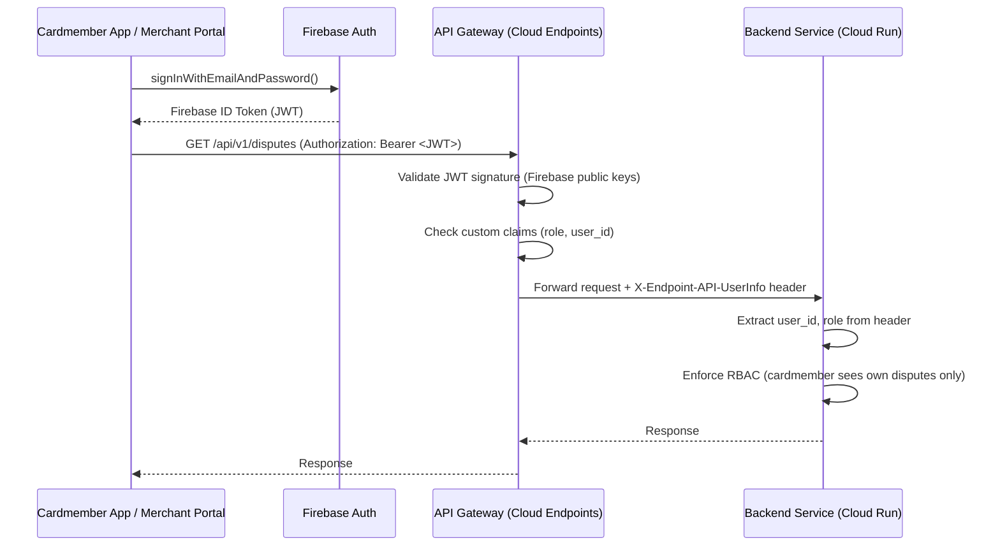
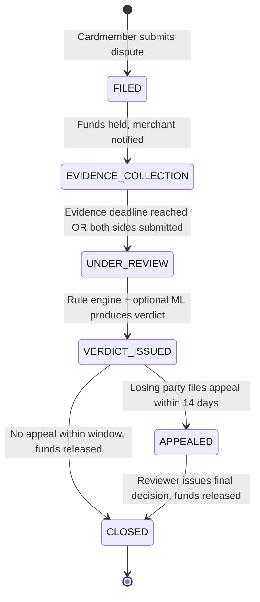

# Dispute Resolution Platform — System & Architecture Design (GCP)

> **Scope**: Deployable prototype. Two dispute categories at launch (non-delivery, unauthorized charge).
> All design decisions traced to pain points in [deep-research-report.md](file:///c:/Users/c9014/OneDrive/Documents/GCH-VR/deep-research-report.md).

---

## 1. System Context Diagram

### Actors

| Actor | Type | Channel |
|---|---|---|
| **Cardmember** | End user | Mobile / Web SPA |
| **Merchant** | End user | Web portal |
| **Human Reviewer** | Internal operator | Back-office web UI (part of merchant portal, gated by role) |
| **Card Network** | External system | Visa / MC / Amex APIs (stubbed in prototype) |
| **Issuer Core Banking** | External system | Funds hold / release API (stubbed) |
| **Acquirer Bank** | External system | Merchant settlement API (stubbed) |

### Boundary & Arrows (text — render separately)

```
┌─────────────────────────────────────────────────────────────────────┐
│                   DISPUTE RESOLUTION PLATFORM                       │
│                                                                     │
│  ┌──────────┐  ┌──────────┐  ┌────────────┐  ┌───────────────────┐ │
│  │ Cardmember│  │ Merchant │  │  Evidence   │  │   Rule Engine     │ │
│  │   BFF    │  │   BFF    │  │  Service    │  │   + ML Classifier │ │
│  └────┬─────┘  └────┬─────┘  └─────┬──────┘  └────────┬──────────┘ │
│       │              │              │                   │            │
│       └──────┬───────┘              │                   │            │
│              ▼                      │                   │            │
│        ┌───────────┐                │                   │            │
│        │  Dispute   │◄──────────────┘                   │            │
│        │  Service   │◄──────────────────────────────────┘            │
│        └─────┬─────┘                                                │
│              │         ┌────────────┐  ┌──────────┐                 │
│              ├────────►│   Funds    │  │  Audit   │                 │
│              │         │  Service   │  │  Service │                 │
│              │         └──────┬─────┘  └────┬─────┘                 │
│              │                │             │                       │
│              ├────────────────┼─────────────┘                       │
│              ▼                ▼                                     │
│        ┌───────────┐  ┌──────────────┐                              │
│        │Notification│  │  Analytics   │                              │
│        │  Service   │  │  Worker      │                              │
│        └───────────┘  └──────────────┘                              │
└─────────────────────────────────────────────────────────────────────┘
         ▲          ▲              │             │
         │          │              ▼             ▼
   ┌─────┴────┐ ┌───┴─────┐  ┌─────────┐  ┌──────────┐
   │Cardmember│ │Merchant │  │  Card    │  │ Issuer   │
   │  App     │ │ Portal  │  │ Network  │  │Core Bank │
   └──────────┘ └─────────┘  │  (stub)  │  │ (stub)   │
                              └─────────┘  └──────────┘
```

### Mermaid C4 (Level 1)



---

## 2. Component Breakdown

### 2.1 API Gateway

| Attribute | Value |
|---|---|
| **Responsibility** | TLS termination, JWT validation, rate limiting, request routing |
| **Inputs** | HTTPS requests from cardmember app, merchant portal, back-office UI |
| **Outputs** | Authenticated requests forwarded to downstream Cloud Run services |
| **Technology** | OpenAPI spec + Cloud Endpoints ESP (Extensible Service Proxy) |
| **GCP Service** | **Cloud Endpoints** on **Cloud Run** (ESPv2 sidecar container) |

### 2.2 Dispute Service

| Attribute | Value |
|---|---|
| **Responsibility** | Core dispute lifecycle state machine: create, transition states, issue verdict, handle appeal. Owns the `disputes`, `verdicts`, `appeals`, and `messages` tables. Orchestrates calls to rule-engine, funds-service, and publishes lifecycle events. |
| **Inputs** | REST from gateway (file dispute, get status, send message, file appeal). Pub/Sub messages from `evidence-processing` and `evaluation-results` topics. |
| **Outputs** | Writes to Cloud SQL. Publishes to `dispute-lifecycle` Pub/Sub topic. Calls funds-service and rule-engine via internal HTTP. |
| **Technology** | Python 3.12 / FastAPI / SQLAlchemy / Alembic |
| **GCP Service** | **Cloud Run** (min 1 instance, max 20) |

### 2.3 Evidence Service

| Attribute | Value |
|---|---|
| **Responsibility** | Accept file uploads (receipts, photos, chat logs, tracking screenshots), store in GCS, call Document AI for OCR / keyword extraction, write parsed metadata back to Cloud SQL. |
| **Inputs** | Multipart file uploads via gateway. |
| **Outputs** | Files to GCS. OCR text + extracted fields to Cloud SQL `evidence` table. Publishes to `evidence-processing` Pub/Sub topic. |
| **Technology** | Python 3.12 / FastAPI / google-cloud-documentai SDK |
| **GCP Service** | **Cloud Run** (min 0, max 10 — bursty on upload) |

### 2.4 Rule Engine

| Attribute | Value |
|---|---|
| **Responsibility** | Load rule definitions (YAML files in GCS, versioned), evaluate deterministic rules against dispute + evidence data, produce an outcome + plain-language explanation. If confidence is below threshold, delegate to ML classifier. |
| **Inputs** | Internal HTTP call from dispute-service (or Pub/Sub trigger). Rule definition files from GCS. |
| **Outputs** | `RuleEvaluationResult` (outcome, confidence, explanation, rules_fired). Publishes to `evaluation-results` Pub/Sub topic. |
| **Technology** | Python 3.12 / FastAPI / PyYAML / custom rule evaluator |
| **GCP Service** | **Cloud Run** (min 1, max 10) |

### 2.5 Gemini Reasoning & Classification API

| Attribute | Value |
|---|---|
| **Responsibility** | Evaluate ambiguous edge cases (e.g., "item not as described"), analyze unstructured evidence text/OCR documents, and generate natural plain-language verdict explanations. Integrated into rule evaluation fallback. |
| **Inputs** | Structured dispute facts + evidence OCR text passed from Rule Engine. |
| **Outputs** | `{ predicted_category, confidence, explanation_text, reasoning_summary }` |
| **Technology** | Google GenAI SDK (`google-genai`) / Gemini 2.5 Flash API |
| **GCP Service** | **Vertex AI Gemini API** (managed Google Cloud AI service) |

### 2.6 Notification Service

| Attribute | Value |
|---|---|
| **Responsibility** | Deliver notifications to cardmembers and merchants: dispute filed, evidence requested, verdict issued, appeal outcome. Supports email (SendGrid) and push (Firebase Cloud Messaging). |
| **Inputs** | Pub/Sub subscription on `dispute-lifecycle` topic. |
| **Outputs** | Emails via SendGrid API. Push via FCM. Delivery status logged. |
| **Technology** | Python 3.12 / FastAPI / sendgrid SDK / firebase-admin SDK |
| **GCP Service** | **Cloud Run** (min 0, max 5 — event-driven) |

### 2.7 Funds Service

| Attribute | Value |
|---|---|
| **Responsibility** | Orchestrate fund holds and releases. In production, this calls issuer core-banking APIs. In the prototype, it simulates hold/release with a `funds_holds` table and stubbed external calls. |
| **Inputs** | Internal HTTP calls from dispute-service. |
| **Outputs** | Updates `funds_holds` table. Returns hold/release confirmation. |
| **Technology** | Python 3.12 / FastAPI / SQLAlchemy |
| **GCP Service** | **Cloud Run** (min 0, max 5) |

### 2.8 Audit Service

| Attribute | Value |
|---|---|
| **Responsibility** | Append-only, immutable audit trail. Every dispute action (filed, evidence submitted, verdict issued, appeal filed, funds moved) is logged with actor, timestamp, and full payload hash. Writes to Firestore (hot) and streams to BigQuery (cold / analytics). |
| **Inputs** | Pub/Sub subscription on `dispute-lifecycle` topic (fan-out). |
| **Outputs** | Firestore documents (immutable). BigQuery streaming inserts. |
| **Technology** | Python 3.12 / FastAPI / google-cloud-firestore / google-cloud-bigquery |
| **GCP Service** | **Cloud Run** (min 1, max 10) |

### 2.9 Analytics Worker

| Attribute | Value |
|---|---|
| **Responsibility** | Scheduled aggregation of dispute metrics: time-to-resolution, auto-resolution rate, win-rate-by-side, serial-disputer flagging, merchant chargeback trends. Reads from BigQuery, writes summary tables and triggers alerts. |
| **Inputs** | BigQuery audit/dispute data. Cloud Scheduler trigger (every 15 min). |
| **Outputs** | BigQuery summary tables. Cloud Monitoring custom metrics. |
| **Technology** | Python 3.12 / google-cloud-bigquery |
| **GCP Service** | **Cloud Functions (2nd gen)** — lightweight, scheduled |

### 2.10 Cardmember Web App

| Attribute | Value |
|---|---|
| **Responsibility** | SPA for cardmembers: view transactions, file disputes, upload evidence, track dispute status, view verdicts, file appeals, respond to mediated evidence requests. |
| **Inputs** | User interactions. API responses from gateway. |
| **Outputs** | API calls to gateway. |
| **Technology** | React 18 / TypeScript / Vite |
| **GCP Service** | **Cloud Storage** (static hosting) + **Cloud CDN** |

### 2.11 Merchant Portal & Admin Console

| Attribute | Value |
|---|---|
| **Responsibility** | SPA for merchants & ops: view incoming disputes (72-hr countdown timer), submit counter-evidence, issue mediated information requests, view verdicts, analytics dashboard. Features an integrated **Visual Rule Authoring UI** (low-code rule editor with live dry-run testing) and an **Appeal Review Queue & Simulator** (with optional Gemini AI Reviewer auto-decisioning). |
| **Inputs** | User interactions. API responses from gateway. |
| **Outputs** | API calls to gateway. |
| **Technology** | React 18 / TypeScript / Vite / Tailwind CSS |
| **GCP Service** | **Cloud Storage** (static hosting) + **Cloud CDN** |

---

## 3. Data Flow — Full Dispute Lifecycle

Below is the end-to-end flow for a **non-delivery dispute**, the primary launch category. Unauthorized-charge follows the same topology with different rule definitions.

### Step-by-step

```
Step  Actor / Trigger            Service                Pub/Sub Topic              Data Crossing Boundary
─────────────────────────────────────────────────────────────────────────────────────────────────────────
 1    Cardmember taps             API Gateway            —                          POST /api/v1/disputes
      "Dispute this charge"                                                         { transaction_ref, category:
                                                                                      NON_DELIVERY, description }

 2    Gateway validates JWT,      Dispute Service        —                          Authenticated request +
      routes to dispute-service                                                     user_id from JWT claims

 3    dispute-service creates     Cloud SQL              → dispute-lifecycle        INSERT disputes row
      dispute record (FILED),                             (event: DISPUTE_FILED)    (status=FILED, amount,
      publishes lifecycle event                                                     merchant_id from txn lookup)

 4    dispute-service calls       Funds Service          —                          POST /internal/v1/funds/hold
      funds-service to hold                                                        { dispute_id, amount, currency }
      funds

 5    funds-service creates       Cloud SQL              → dispute-lifecycle        INSERT funds_holds row
      hold record, returns                                (event: FUNDS_HELD)       (status=HELD)
      confirmation

 6    notification-service        Notification Service   ← dispute-lifecycle        Merchant notified via email
      (subscriber) sends                                  (event: DISPUTE_FILED)    + push: "New dispute on
      merchant alert                                                                order #XYZ"

 7    audit-service (subscriber)  Audit Service          ← dispute-lifecycle        Firestore: { dispute_id,
      logs FILED event                                    (event: DISPUTE_FILED)    actor: cardmember_id,
                                                                                    action: FILED, ts, hash }

 8    Cardmember uploads          API Gateway →          —                          POST /api/v1/disputes/{id}/
      receipt photo               Evidence Service                                  evidence (multipart: file +
                                                                                    metadata)

 9    evidence-service stores     Cloud Storage          —                          gs://drp-evidence-{env}/
      file in GCS                                                                   {dispute_id}/{uuid}.jpg

10    evidence-service calls      Document AI            —                          OCR request → extracted text,
      Document AI for OCR                                                           keywords, entities

11    evidence-service writes     Cloud SQL              → evidence-processing      INSERT evidence row (type,
      parsed metadata, publishes                          (event: EVIDENCE_READY,   ocr_text, extracted_fields,
      event                                               side: CARDMEMBER)         gcs_uri)

12    Merchant logs into portal,  API Gateway →          —                          POST /api/v1/disputes/{id}/
      uploads shipping proof      Evidence Service                                  evidence (multipart: tracking
                                                                                    PDF)

13    Steps 9-11 repeat for      Evidence Service       → evidence-processing       evidence row (side: MERCHANT,
      merchant evidence                                   (event: EVIDENCE_READY,   tracking_number, delivery_
                                                           side: MERCHANT)           confirmation)

14    dispute-service (subscriber Dispute Service        ← evidence-processing      Checks: both sides submitted?
      on evidence-processing)                                                       Evidence window expired?
      evaluates readiness                                                           If ready → next step

15    dispute-service calls       Rule Engine            —                          POST /internal/v1/evaluate
      rule-engine                                                                   { dispute_id, category,
                                                                                     evidence_summaries,
                                                                                     transaction_data }

16    rule-engine loads YAML      Cloud Storage          —                          gs://drp-rules-{env}/
      rules for NON_DELIVERY                                                        non_delivery/v1.yaml
      category

17    rule-engine evaluates       (in-process)           —                          Rules fired:
      deterministic rules                                                           - tracking_shows_delivered?
                                                                                    - address_matches?
                                                                                    - delivery_within_window?

18a   IF rules produce high-     Rule Engine             → evaluation-results       { outcome: MERCHANT_WIN,
      confidence result (≥0.85)                           (event: EVALUATION_DONE)  confidence: 0.92,
                                                                                    explanation: "Tracking
                                                                                    confirms delivery to
                                                                                    your address on June 5" }

18b   IF ambiguous (<0.85),      Rule Engine →           —                          POST vertex-ai-endpoint
      rule-engine calls ML        ML Classifier                                     { features: [...] }
      classifier                  (Vertex AI)                                       Response: { predicted_
                                                                                    category, confidence }
      Then re-evaluates with     Rule Engine             → evaluation-results       Combined result published
      ML signal                                           (event: EVALUATION_DONE)

19    dispute-service (subscriber Dispute Service        ← evaluation-results       Updates dispute status to
      on evaluation-results)                                                        VERDICT_ISSUED, writes
      issues verdict                                                                verdict row

20    dispute-service publishes   —                      → dispute-lifecycle        { event: VERDICT_ISSUED,
      verdict event                                       (VERDICT_ISSUED)          outcome, explanation }

21    notification-service sends  Notification Service   ← dispute-lifecycle        Both parties notified:
      verdict to both parties                                                       plain-language explanation

22    dispute-service calls       Funds Service          —                          POST /internal/v1/funds/
      funds-service to release                                                      release { dispute_id,
      or return funds                                                               direction: TO_CARDMEMBER
                                                                                    | TO_MERCHANT }

23    funds-service updates hold  Cloud SQL              → dispute-lifecycle        funds_holds.status =
      record, publishes event                             (event: FUNDS_RELEASED)   RELEASED_TO_CARDMEMBER

24    audit-service logs all      Audit Service          ← dispute-lifecycle        Full trail: FILED → EVIDENCE
      events to Firestore +                               (all events)              → EVALUATED → VERDICT →
      BigQuery                                                                      FUNDS_RELEASED

25    (Optional) Losing party     API Gateway →          —                          POST /api/v1/disputes/{id}/
      files appeal within         Dispute Service                                   appeal { reason }
      window (14 days)

26    dispute-service creates     Cloud SQL              → dispute-lifecycle        appeal.status = FILED,
      appeal, routes to human                             (event: APPEAL_FILED)     assigned to human reviewer
      reviewer queue

27    Human reviewer reviews      Dispute Service        → dispute-lifecycle        Verdict upheld or overturned;
      in back-office UI,                                  (event: APPEAL_RESOLVED)  new verdict explanation
      issues final decision
```

### Pub/Sub Topic Topology

| Topic | Publishers | Subscribers | Message Attributes |
|---|---|---|---|
| `dispute-lifecycle` | dispute-service, funds-service | notification-service, audit-service, analytics (BQ sink) | `event_type`, `dispute_id`, `category` |
| `evidence-processing` | evidence-service | dispute-service, rule-engine | `event_type`, `dispute_id`, `side` |
| `evaluation-results` | rule-engine | dispute-service | `event_type`, `dispute_id`, `outcome` |

---

## 4. Data Model

### 4.1 Entity-Relationship Diagram



### 4.2 Store Ownership

| Entity | Store | Engine | Why |
|---|---|---|---|
| `users` | Cloud SQL | PostgreSQL 15 | Relational, transactional, referenced by every other entity |
| `disputes` | Cloud SQL | PostgreSQL 15 | Core lifecycle state machine requires ACID transactions for status updates |
| `evidence` (metadata) | Cloud SQL | PostgreSQL 15 | Joins to disputes; OCR text indexed for search |
| Evidence files | Cloud Storage | — | Binary blobs (images, PDFs) up to 25 MB; GCS is purpose-built |
| `verdicts` | Cloud SQL | PostgreSQL 15 | 1:1 with dispute; relational integrity required |
| `appeals` | Cloud SQL | PostgreSQL 15 | Same as verdicts |
| `funds_holds` | Cloud SQL | PostgreSQL 15 | Transactional — must be consistent with dispute status |
| `messages` | Cloud SQL | PostgreSQL 15 | Ordered by timestamp, joins to dispute + user |
| `abuse_flags` | Cloud SQL | PostgreSQL 15 | Queried with user joins; analytics also reads from BQ copy |
| Audit trail (hot) | Firestore | — | Append-only document model, security rules prevent update/delete, real-time queries for compliance |
| Audit trail (cold) | BigQuery | — | Columnar analytics: aggregations, trend queries, fairness checks |
| Rule definitions | Cloud Storage | — | Versioned YAML files loaded at evaluation time; no DB needed |
| ML model artifacts | Vertex AI Model Registry | — | Versioned model binaries with lineage |

### 4.3 SQL DDL (PostgreSQL)

```sql
-- Enable UUID generation
CREATE EXTENSION IF NOT EXISTS "pgcrypto";

CREATE TYPE user_type AS ENUM ('CARDMEMBER', 'MERCHANT', 'REVIEWER');
CREATE TYPE dispute_category AS ENUM ('NON_DELIVERY', 'UNAUTHORIZED_CHARGE');
CREATE TYPE dispute_status AS ENUM (
    'FILED', 'EVIDENCE_COLLECTION', 'UNDER_REVIEW',
    'VERDICT_ISSUED', 'APPEALED', 'CLOSED'
);
CREATE TYPE evidence_type AS ENUM (
    'RECEIPT', 'PHOTO', 'TRACKING', 'CHAT_LOG',
    'ORDER_CONFIRMATION', 'OTHER'
);
CREATE TYPE evidence_side AS ENUM ('CARDMEMBER', 'MERCHANT');
CREATE TYPE verdict_outcome AS ENUM ('CARDMEMBER_WIN', 'MERCHANT_WIN');
CREATE TYPE verdict_issuer AS ENUM ('SYSTEM', 'HUMAN');
CREATE TYPE hold_status AS ENUM ('HELD', 'RELEASED_TO_CARDMEMBER', 'RETURNED_TO_MERCHANT');
CREATE TYPE appeal_status AS ENUM ('FILED', 'UNDER_REVIEW', 'RESOLVED');
CREATE TYPE appeal_outcome AS ENUM ('UPHELD', 'OVERTURNED');
CREATE TYPE flag_type AS ENUM ('SERIAL_DISPUTER', 'HIGH_CHARGEBACK_RATE');

CREATE TABLE users (
    id          UUID PRIMARY KEY DEFAULT gen_random_uuid(),
    type        user_type       NOT NULL,
    email       VARCHAR(255)    NOT NULL UNIQUE,
    phone       VARCHAR(20),
    display_name VARCHAR(100),
    firebase_uid VARCHAR(128)   NOT NULL UNIQUE,
    created_at  TIMESTAMPTZ     NOT NULL DEFAULT now(),
    updated_at  TIMESTAMPTZ     NOT NULL DEFAULT now()
);

CREATE TABLE disputes (
    id                UUID PRIMARY KEY DEFAULT gen_random_uuid(),
    cardmember_id     UUID            NOT NULL REFERENCES users(id),
    merchant_id       UUID            NOT NULL REFERENCES users(id),
    transaction_ref   VARCHAR(128)    NOT NULL,  -- tokenized, never a PAN
    category          dispute_category NOT NULL,
    status            dispute_status  NOT NULL DEFAULT 'FILED',
    amount            NUMERIC(12,2)   NOT NULL,
    currency          VARCHAR(3)      NOT NULL DEFAULT 'USD',
    description       TEXT,
    filed_at          TIMESTAMPTZ     NOT NULL DEFAULT now(),
    evidence_deadline TIMESTAMPTZ     NOT NULL DEFAULT (now() + INTERVAL '72 hours'),
    resolved_at       TIMESTAMPTZ,
    rule_set_version  VARCHAR(64),
    created_at        TIMESTAMPTZ     NOT NULL DEFAULT now(),
    updated_at        TIMESTAMPTZ     NOT NULL DEFAULT now()
);
CREATE INDEX idx_disputes_cardmember ON disputes(cardmember_id);
CREATE INDEX idx_disputes_merchant   ON disputes(merchant_id);
CREATE INDEX idx_disputes_status     ON disputes(status);

CREATE TABLE evidence (
    id               UUID PRIMARY KEY DEFAULT gen_random_uuid(),
    dispute_id       UUID           NOT NULL REFERENCES disputes(id),
    submitted_by     UUID           NOT NULL REFERENCES users(id),
    side             evidence_side  NOT NULL,
    evidence_type    evidence_type  NOT NULL,
    gcs_uri          TEXT           NOT NULL,
    ocr_text         TEXT,
    extracted_fields JSONB,
    content_hash     VARCHAR(64)    NOT NULL,
    created_at       TIMESTAMPTZ    NOT NULL DEFAULT now()
);
CREATE INDEX idx_evidence_dispute ON evidence(dispute_id);

CREATE TABLE verdicts (
    id          UUID PRIMARY KEY DEFAULT gen_random_uuid(),
    dispute_id  UUID            NOT NULL UNIQUE REFERENCES disputes(id),
    outcome     verdict_outcome NOT NULL,
    explanation TEXT            NOT NULL,
    rules_fired JSONB,
    confidence  REAL,
    issued_by   verdict_issuer  NOT NULL DEFAULT 'SYSTEM',
    reviewer_id UUID            REFERENCES users(id),
    issued_at   TIMESTAMPTZ     NOT NULL DEFAULT now()
);

CREATE TABLE appeals (
    id             UUID PRIMARY KEY DEFAULT gen_random_uuid(),
    dispute_id     UUID           NOT NULL UNIQUE REFERENCES disputes(id),
    filed_by       UUID           NOT NULL REFERENCES users(id),
    reason         TEXT           NOT NULL,
    status         appeal_status  NOT NULL DEFAULT 'FILED',
    reviewer_id    UUID           REFERENCES users(id),
    review_notes   TEXT,
    appeal_outcome appeal_outcome,
    filed_at       TIMESTAMPTZ    NOT NULL DEFAULT now(),
    resolved_at    TIMESTAMPTZ
);

CREATE TABLE funds_holds (
    id               UUID PRIMARY KEY DEFAULT gen_random_uuid(),
    dispute_id       UUID        NOT NULL UNIQUE REFERENCES disputes(id),
    amount           NUMERIC(12,2) NOT NULL,
    currency         VARCHAR(3)  NOT NULL DEFAULT 'USD',
    status           hold_status NOT NULL DEFAULT 'HELD',
    external_hold_ref VARCHAR(128),
    held_at          TIMESTAMPTZ NOT NULL DEFAULT now(),
    released_at      TIMESTAMPTZ
);

CREATE TYPE mediated_request_status AS ENUM ('PENDING', 'RESPONDED', 'EXPIRED');

CREATE TABLE mediated_requests (
    id             UUID PRIMARY KEY DEFAULT gen_random_uuid(),
    dispute_id     UUID                   NOT NULL REFERENCES disputes(id) ON DELETE CASCADE,
    requested_by   UUID                   NOT NULL REFERENCES users(id),
    request_type   VARCHAR(64)            NOT NULL,
    message        TEXT                   NOT NULL,
    response_text  TEXT,
    response_gcs_uri TEXT,
    status         mediated_request_status NOT NULL DEFAULT 'PENDING',
    created_at     TIMESTAMPTZ            NOT NULL DEFAULT now(),
    responded_at   TIMESTAMPTZ
);
CREATE INDEX idx_mediated_requests_dispute ON mediated_requests(dispute_id);

CREATE TABLE abuse_flags (
    id         UUID PRIMARY KEY DEFAULT gen_random_uuid(),
    user_id    UUID      NOT NULL REFERENCES users(id),
    dispute_id UUID      REFERENCES disputes(id),
    flag_type  flag_type NOT NULL,
    score      REAL      NOT NULL,
    details    JSONB,
    created_at TIMESTAMPTZ NOT NULL DEFAULT now()
);
CREATE INDEX idx_abuse_flags_user ON abuse_flags(user_id);
```

### 4.4 Firestore Audit Document Schema

```
Collection: audit_events
Document ID: auto-generated

{
  "dispute_id": "uuid",
  "actor_id": "uuid",
  "actor_type": "CARDMEMBER | MERCHANT | SYSTEM | REVIEWER",
  "action": "DISPUTE_FILED | EVIDENCE_SUBMITTED | EVALUATION_COMPLETE | VERDICT_ISSUED | APPEAL_FILED | APPEAL_RESOLVED | FUNDS_HELD | FUNDS_RELEASED",
  "details": { ... },           // action-specific payload
  "payload_hash": "sha256",     // integrity verification
  "timestamp": Timestamp,
  "environment": "dev | staging | prod"
}
```

Firestore security rules (append-only):
```
rules_version = '2';
service cloud.firestore {
  match /databases/{database}/documents {
    match /audit_events/{event} {
      allow create: if request.auth != null
                    && request.auth.token.service_account == true;
      allow read: if request.auth != null
                  && request.auth.token.role == 'REVIEWER';
      allow update, delete: if false;  // immutable
    }
  }
}
```

---

## 5. GCP Service Mapping

| Component | GCP Product | Justification |
|---|---|---|
| API Gateway | **Cloud Endpoints** (ESPv2 on Cloud Run) | OpenAPI-driven routing, JWT validation built-in, rate limiting via service control. Simpler than Apigee for a prototype. |
| Dispute Service | **Cloud Run** | Request/response + Pub/Sub push. Scales 0→20. No Kubernetes overhead. Stateless; state lives in Cloud SQL. |
| Evidence Service | **Cloud Run** | Handles bursty upload traffic. Auto-scales on concurrent requests. 32 MB request limit covers evidence files. |
| Rule Engine | **Cloud Run** | CPU-bound rule evaluation. Needs fast startup (Python). Min-instances=1 avoids cold start on critical path. |
| Gemini Reasoning API | **Vertex AI Gemini API** | Managed Google Cloud AI model (Gemini 2.5 Flash) via `google-genai` SDK for unstructured evidence reasoning and explainable plain-language verdict generation. |
| Notification Service | **Cloud Run** | Event-driven (Pub/Sub push). Scales to zero when no notifications pending. |
| Funds Service | **Cloud Run** | Low-traffic, request/response. Stubbed external calls are fast. |
| Audit Service | **Cloud Run** | Event-driven (Pub/Sub push). Writes to Firestore + BigQuery — both have client libraries with retry. |
| Analytics Worker | **Cloud Functions (2nd gen)** | Scheduled (Cloud Scheduler), short-lived, no long-running state. Cheaper than always-on Cloud Run for periodic aggregation. |
| Relational DB | **Cloud SQL (PostgreSQL 15)** | ACID transactions for dispute lifecycle. Managed backups, HA optional. Prototype: db-f1-micro tier. PostgreSQL over MySQL for JSONB, rich enum support. |
| Object Storage | **Cloud Storage** (Standard) | Evidence files (images, PDFs). Signed URLs for secure direct access. Lifecycle policies for retention. |
| Audit Store | **Firestore** (Native mode) | Append-only document store. Security rules enforce immutability. Sub-10ms reads for compliance queries. |
| Analytics Warehouse | **BigQuery** | Columnar analytics on dispute outcomes, fairness metrics, trends. Streaming inserts from audit-service. Serverless, no capacity planning. |
| Event Bus | **Cloud Pub/Sub** | At-least-once delivery, push subscriptions to Cloud Run. Decouples services. Dead-letter topics for failed messages. |
| OCR / Doc Parsing | **Document AI** (Form Parser) | Pre-trained receipt/invoice parser. Better than raw Vision API for structured extraction. Pay-per-page. |
| Auth | **Firebase Authentication** | Managed user auth with email/password + Google sign-in. Issues JWTs validated by Cloud Endpoints. Free tier covers prototype. |
| Secrets | **Secret Manager** | Database credentials, API keys, SendGrid token. Versioned. IAM-gated per service account. |
| Encryption Keys | **Cloud KMS** | CMEK for Cloud SQL and GCS. Rotation policies. Required for PCI-adjacent controls. |
| Container Registry | **Artifact Registry** | Docker images for all Cloud Run services. Vulnerability scanning enabled. |
| CI/CD | **Cloud Build** | Dockerfile builds, Terraform apply, deploy to Cloud Run. Triggered by GitHub pushes. |
| Monitoring | **Cloud Monitoring + Cloud Logging** | Structured logs, custom metrics (time-to-resolution, auto-resolve rate), alerting policies. |
| CDN / Static Hosting | **Cloud Storage + Cloud CDN** | SPA assets (React bundles). Global edge caching. HTTPS via managed SSL. |
| Scheduling | **Cloud Scheduler** | Triggers analytics-worker every 15 min. Cron syntax. |
| Networking | **Serverless VPC Access Connector** | Cloud Run → Cloud SQL private connectivity. No public DB endpoint. |

---

## 6. API Contracts

### 6.1 Dispute Service — Public APIs

| Method | Path | Auth | Request Body | Response (200) | Notes |
|---|---|---|---|---|---|
| `POST` | `/api/v1/disputes` | Cardmember JWT | `{ transaction_ref, category, description }` | `{ id, status, filed_at, evidence_deadline }` | Creates dispute, holds funds, notifies merchant |
| `GET` | `/api/v1/disputes` | Any JWT | Query: `?status=&page=&size=` | `{ items: [Dispute], total, page }` | Filtered by caller role: cardmembers see own, merchants see theirs |
| `GET` | `/api/v1/disputes/{id}` | Any JWT | — | `Dispute` (full, including verdict if issued) | 403 if caller is not a party to the dispute |
| `GET` | `/api/v1/disputes/{id}/timeline` | Any JWT | — | `{ events: [{ action, actor, timestamp, detail }] }` | Read from Firestore audit trail |
| `POST` | `/api/v1/disputes/{id}/messages` | Any JWT (party) | `{ content }` | `{ id, sender_id, created_at }` | In-dispute messaging |
| `GET` | `/api/v1/disputes/{id}/messages` | Any JWT (party) | Query: `?cursor=&limit=` | `{ items: [Message], next_cursor }` | Paginated |
| `POST` | `/api/v1/disputes/{id}/appeal` | Any JWT (losing party) | `{ reason }` | `{ id, status, filed_at }` | Only within appeal window (14 days post-verdict) |
| `GET` | `/api/v1/disputes/{id}/verdict` | Any JWT (party) | — | `{ outcome, explanation, confidence, issued_by, issued_at }` | 404 if no verdict yet |

#### Dispute Object Shape

```json
{
  "id": "uuid",
  "cardmember_id": "uuid",
  "merchant_id": "uuid",
  "transaction_ref": "tok_abc123",
  "category": "NON_DELIVERY",
  "status": "VERDICT_ISSUED",
  "amount": 149.99,
  "currency": "USD",
  "description": "Item never arrived",
  "filed_at": "2026-07-20T10:30:00Z",
  "evidence_deadline": "2026-07-27T10:30:00Z",
  "resolved_at": "2026-07-20T10:35:22Z",
  "verdict": {
    "outcome": "MERCHANT_WIN",
    "explanation": "Shipping records confirm delivery to your registered address on July 18. Signature on file matches account holder name.",
    "confidence": 0.94,
    "issued_by": "SYSTEM"
  }
}
```

### 6.2 Evidence Service — Public APIs

| Method | Path | Auth | Request Body | Response (200) | Notes |
|---|---|---|---|---|---|
| `POST` | `/api/v1/disputes/{id}/evidence` | Any JWT (party) | Multipart: `file` (binary) + `metadata` (JSON: `{ evidence_type }`) | `{ id, evidence_type, gcs_uri, created_at }` | Max 25 MB. OCR runs async; `ocr_text` populated later. |
| `GET` | `/api/v1/disputes/{id}/evidence` | Any JWT (party) | — | `{ items: [Evidence] }` | Both sides' evidence visible to both parties (transparency) |
| `GET` | `/api/v1/evidence/{id}/download` | Any JWT (party) | — | `{ signed_url, expires_at }` | GCS signed URL, 15-min TTL |

#### Evidence Object Shape

```json
{
  "id": "uuid",
  "dispute_id": "uuid",
  "submitted_by": "uuid",
  "side": "MERCHANT",
  "evidence_type": "TRACKING",
  "gcs_uri": "gs://drp-evidence-dev/dispute-uuid/file-uuid.pdf",
  "ocr_text": "USPS Tracking: 9400111899223...\nDelivered July 18 2026 2:34pm\nLeft at: Front Door",
  "extracted_fields": {
    "carrier": "USPS",
    "tracking_number": "9400111899223...",
    "delivery_date": "2026-07-18",
    "delivery_status": "DELIVERED",
    "delivery_location": "Front Door"
  },
  "content_hash": "sha256:a1b2c3...",
  "created_at": "2026-07-20T10:32:00Z"
}
```

### 6.3 Rule Engine — Internal API

| Method | Path | Auth | Request Body | Response (200) |
|---|---|---|---|---|
| `POST` | `/internal/v1/evaluate` | Service-account IAM | `{ dispute_id, category, transaction_data, evidence_summaries: [{ side, type, ocr_text, extracted_fields }] }` | `{ outcome, confidence, explanation, rules_fired: [{ rule_id, result, weight }], ml_used: bool }` |

### 6.4 ML Classifier — Internal API (Vertex AI Endpoint)

| Method | Path | Auth | Request Body | Response (200) |
|---|---|---|---|---|
| `POST` | `/v1/models/{model}/predict` | Service-account IAM | `{ instances: [{ dispute_text, evidence_texts, amount, category, merchant_category_code }] }` | `{ predictions: [{ category: "NON_DELIVERY", confidence: 0.87, top_features: [...] }] }` |

### 6.5 Funds Service — Internal API

| Method | Path | Auth | Request Body | Response (200) |
|---|---|---|---|---|
| `POST` | `/internal/v1/funds/hold` | Service-account IAM | `{ dispute_id, amount, currency }` | `{ hold_id, status: "HELD", held_at }` |
| `POST` | `/internal/v1/funds/release` | Service-account IAM | `{ dispute_id, direction: "TO_CARDMEMBER" \| "TO_MERCHANT" }` | `{ hold_id, status, released_at }` |

### 6.6 Auth — Firebase Auth (managed, no custom endpoints)

| Flow | Method | Notes |
|---|---|---|
| Register | Firebase SDK `createUserWithEmailAndPassword()` | Client-side. On success, a Cloud Function creates the `users` row in Cloud SQL. |
| Login | Firebase SDK `signInWithEmailAndPassword()` | Returns Firebase ID token (JWT). |
| Token refresh | Firebase SDK `getIdToken(forceRefresh: true)` | Automatic. |
| Custom claims | Cloud Function `setCustomUserClaims()` | Sets `role: CARDMEMBER \| MERCHANT \| REVIEWER` on the JWT. Gateway validates. |

### 6.7 Human Review — Back-office (part of Dispute Service)

| Method | Path | Auth | Request Body | Response (200) | Notes |
|---|---|---|---|---|---|
| `GET` | `/api/v1/reviews/queue` | Reviewer JWT | Query: `?status=FILED&page=&size=` | `{ items: [Appeal], total }` | Appeals awaiting review |
| `POST` | `/api/v1/reviews/{appeal_id}/decide` | Reviewer JWT | `{ appeal_outcome: "UPHELD" \| "OVERTURNED", review_notes }` | `{ appeal_id, status: "RESOLVED", resolved_at }` | Publishes APPEAL_RESOLVED event |

---

## 7. Security & Compliance Design

### 7.1 Authentication & Authorization



**RBAC Matrix:**

| Role | Disputes | Evidence | Verdicts | Appeals | Reviews | Analytics |
|---|---|---|---|---|---|---|
| CARDMEMBER | Create, read own | Upload (own side), read all on own disputes | Read own | File on own | ✗ | ✗ |
| MERCHANT | Read assigned | Upload (own side), read all on assigned disputes | Read assigned | File on assigned | ✗ | Read own trends |
| REVIEWER | Read all | Read all | Read all | Read all | Decide | Read all |

### 7.2 Data Protection & Tokenization

| Data Class | Treatment | Implementation |
|---|---|---|
| **PAN / Card number** | **Never stored.** Only tokenized `transaction_ref` (e.g. `tok_abc123`) from the issuer's tokenization service. | Issuer API returns token at dispute creation. All internal references use token. |
| **PII (email, phone, name)** | Stored encrypted at rest in Cloud SQL. Accessible only via authenticated APIs. | Cloud SQL default encryption + CMEK via Cloud KMS. Application-level access control. |
| **Evidence files** | Encrypted at rest in GCS. Accessed via time-limited signed URLs (15 min). | GCS default encryption + CMEK. Signed URLs generated per-request with caller validation. |
| **Audit trail** | Immutable. Payload hashed (SHA-256) for integrity verification. | Firestore security rules: `allow update, delete: if false`. Hash stored alongside payload. |
| **Transaction amounts** | Stored in Cloud SQL, not classified as PCI-sensitive (amounts are not cardholder data). | Standard DB encryption. |

### 7.3 Encryption

| Layer | Mechanism |
|---|---|
| **In transit** | TLS 1.3 everywhere. Cloud Run enforces HTTPS. Internal service-to-service uses Cloud Run's built-in TLS. Pub/Sub messages encrypted in transit (Google-managed). |
| **At rest — Cloud SQL** | AES-256, Google-managed by default. Upgraded to CMEK (Cloud KMS `drp-sql-key`) for PCI-adjacent compliance. |
| **At rest — Cloud Storage** | AES-256, CMEK (`drp-gcs-key`). Per-bucket key. |
| **At rest — Firestore** | AES-256, Google-managed (CMEK not available for Firestore in all regions; accept for prototype). |
| **At rest — BigQuery** | AES-256, Google-managed. CMEK available if needed. |
| **Secrets** | Secret Manager: database passwords, API keys, SendGrid token. Accessed via IAM, not environment variables. |

### 7.4 IAM Boundaries

Each Cloud Run service runs under a **dedicated service account** with least-privilege IAM bindings:

| Service | Service Account | IAM Roles |
|---|---|---|
| dispute-service | `dispute-svc@{project}.iam` | `roles/cloudsql.client`, `roles/pubsub.publisher`, `roles/run.invoker` (on funds-svc, rule-engine) |
| evidence-service | `evidence-svc@{project}.iam` | `roles/cloudsql.client`, `roles/storage.objectCreator` (evidence bucket), `roles/documentai.apiUser`, `roles/pubsub.publisher` |
| rule-engine | `rule-engine-svc@{project}.iam` | `roles/cloudsql.viewer`, `roles/storage.objectViewer` (rules bucket), `roles/aiplatform.user` (Vertex AI), `roles/pubsub.publisher` |
| notification-service | `notif-svc@{project}.iam` | `roles/pubsub.subscriber` |
| funds-service | `funds-svc@{project}.iam` | `roles/cloudsql.client`, `roles/pubsub.publisher` |
| audit-service | `audit-svc@{project}.iam` | `roles/datastore.user` (Firestore), `roles/bigquery.dataEditor`, `roles/pubsub.subscriber` |
| analytics-worker | `analytics-worker@{project}.iam` | `roles/bigquery.dataEditor`, `roles/bigquery.jobUser`, `roles/monitoring.metricWriter` |

### 7.5 Network Isolation

- Cloud SQL has **no public IP**. Accessible only via **Serverless VPC Access Connector** from Cloud Run.
- Cloud Run services are set to **ingress: internal-and-cloud-load-balancing** (except API gateway which is `all`).
- Internal services (rule-engine, funds-service) require **IAM authentication** (`--no-allow-unauthenticated`). Only the dispute-service's service account can invoke them.

### 7.6 PCI-Adjacent Controls (Prototype Scope)

| Control | Implementation |
|---|---|
| No PAN storage | Enforced by design — `transaction_ref` is a token. DB column constraints prevent PAN-format strings (regex check trigger). |
| Access logging | Cloud Audit Logs enabled for all data-access operations. |
| Key rotation | Cloud KMS keys configured for 90-day automatic rotation. |
| Vulnerability scanning | Artifact Registry scans container images on push. |
| Secrets rotation | Secret Manager versions; services reload on version change (no restart needed with client library lazy-load). |

---

## 8. Scalability & Extensibility

### 8.1 Adding New Dispute Categories (Zero-Redeploy)

The rule engine loads rule definitions from **versioned YAML files in Cloud Storage**, not from compiled code.

**Rule definition format** (example: `gs://drp-rules-dev/non_delivery/v2.yaml`):

```yaml
# Rule definition for NON_DELIVERY disputes
version: "2"
category: "NON_DELIVERY"
description: "Rules for item-not-received disputes"
evidence_requirements:
  cardmember:
    - type: ORDER_CONFIRMATION
      required: false
    - type: RECEIPT
      required: false
  merchant:
    - type: TRACKING
      required: true
      weight: 0.4
    - type: ORDER_CONFIRMATION
      required: false
      weight: 0.2

rules:
  - id: "ND-001"
    name: "tracking_confirms_delivery"
    description: "Tracking shows delivered to cardmember's address"
    conditions:
      - field: "merchant.evidence.TRACKING.extracted_fields.delivery_status"
        operator: "eq"
        value: "DELIVERED"
      - field: "merchant.evidence.TRACKING.extracted_fields.delivery_address"
        operator: "fuzzy_match"
        target: "dispute.cardmember_address"
        threshold: 0.8
    outcome: "MERCHANT_WIN"
    weight: 0.5
    explanation_template: >
      Shipping records confirm delivery to your registered address
      on {delivery_date}. {signature_clause}

  - id: "ND-002"
    name: "no_tracking_provided"
    description: "Merchant failed to provide tracking"
    conditions:
      - field: "merchant.evidence.TRACKING"
        operator: "not_exists"
    outcome: "CARDMEMBER_WIN"
    weight: 0.6
    explanation_template: >
      The merchant did not provide shipping or tracking information
      to confirm delivery of your order.

  - id: "ND-003"
    name: "delivery_outside_window"
    description: "Delivered after promised date"
    conditions:
      - field: "merchant.evidence.TRACKING.extracted_fields.delivery_date"
        operator: "gt"
        target: "transaction.promised_delivery_date"
    outcome: "CARDMEMBER_WIN"
    weight: 0.3
    explanation_template: >
      The item was delivered on {delivery_date}, which is after the
      promised delivery date of {promised_date}.

ml_fallback:
  enabled: true
  confidence_threshold: 0.85
  model_endpoint: "projects/{project}/locations/us-central1/endpoints/{endpoint_id}"
```

**To add a new category** (e.g., "duplicate charge"):

1. Author `gs://drp-rules-{env}/duplicate_charge/v1.yaml`
2. Add `DUPLICATE_CHARGE` to the `dispute_category` enum in PostgreSQL (`ALTER TYPE dispute_category ADD VALUE 'DUPLICATE_CHARGE'`)
3. Update the cardmember app's category picker (frontend config, not a backend deploy)
4. **No service redeployment required** — the rule engine loads rules by category from GCS at evaluation time, with a 5-minute TTL cache.

### 8.2 ML Model Versioning & Retraining

```mermaid
graph LR
    A["Historical dispute data<br/>(BigQuery)"] --> B["Training pipeline<br/>(Vertex AI Pipelines)"]
    B --> C["Model artifact<br/>(Vertex AI Model Registry)"]
### 8.2 Gemini 2.5 Flash AI Reasoning & Versioning

- **Reasoning Engine**: Google GenAI SDK (`google-genai`) calling Gemini 2.5 Flash API via Vertex AI or API Key.
- **Prompt & Schema Versioning**: Prompt templates and structured JSON output schemas (`GeminiVerdictSchema`) are versioned alongside rule definition YAML files in Cloud Storage (`gs://drp-rules-{env}/prompts/v1.json`).
- **Confidence Threshold**: Gemini 2.5 Flash generates a structured outcome, explanation, and confidence score. If confidence >= 0.85, the verdict is issued automatically. If confidence < 0.85, the dispute is flagged for review.
- **Prototype Mode**: Invoked directly via `google-genai` Python SDK without needing custom container deployment or training pipelines.

### 8.3 Horizontal Scaling

| Component | Scaling Strategy |
|---|---|
| Cloud Run services | Auto-scale on concurrent requests (default: max 80 concurrent per instance). Max instances capped per service (see §2). |
| Cloud SQL | Vertical scaling (increase machine type). Read replicas for analytics queries. Prototype starts on `db-f1-micro`. |
| Pub/Sub | Fully managed, scales automatically. No configuration needed. |
| Vertex AI Endpoint | Auto-scale on prediction QPS. Min replicas = 1 in prototype. |
| BigQuery | Serverless, auto-scales. On-demand pricing in prototype; switch to slots for production. |
| Cloud Storage | Unlimited. No scaling concern. |

### 8.4 Multi-Tenancy (Future)

The prototype is single-tenant (one issuer). To support multiple issuers:
- Add `issuer_id` to `disputes`, `users`, and all dependent tables.
- Row-level security in PostgreSQL.
- Separate GCS buckets per issuer (or prefix-based isolation).
- IAM-gated API access per issuer.

---

## 9. Deployment Package

### 9.1 Repository Structure

```
drp-platform/
├── infrastructure/
│   └── terraform/
│       ├── main.tf
│       ├── variables.tf
│       ├── outputs.tf
│       ├── network.tf
│       ├── database.tf
│       ├── storage.tf
│       ├── pubsub.tf
│       ├── cloudrun.tf
│       ├── iam.tf
│       ├── bigquery.tf
│       ├── firestore.tf
│       ├── monitoring.tf
│       └── environments/
│           ├── dev.tfvars
│           ├── staging.tfvars
│           └── prod.tfvars
├── services/
│   ├── dispute-service/
│   │   ├── Dockerfile
│   │   ├── main.py
│   │   ├── requirements.txt
│   │   ├── app/
│   │   │   ├── __init__.py
│   │   │   ├── routes.py
│   │   │   ├── models.py
│   │   │   ├── schemas.py
│   │   │   ├── state_machine.py
│   │   │   └── pubsub.py
│   │   └── tests/
│   ├── evidence-service/
│   │   ├── Dockerfile
│   │   ├── main.py
│   │   ├── requirements.txt
│   │   └── app/
│   ├── rule-engine/
│   │   ├── Dockerfile
│   │   ├── main.py
│   │   ├── requirements.txt
│   │   └── app/
│   │       ├── evaluator.py
│   │       ├── rule_loader.py
│   │       └── gemini_client.py
│   ├── notification-service/
│   │   ├── Dockerfile
│   │   ├── main.py
│   │   └── requirements.txt
│   ├── funds-service/
│   │   ├── Dockerfile
│   │   ├── main.py
│   │   └── requirements.txt
│   └── audit-service/
│       ├── Dockerfile
│       ├── main.py
│       └── requirements.txt
├── frontend/
│   ├── cardmember-web/
│   │   ├── Dockerfile          # for local dev
│   │   ├── package.json
│   │   ├── vite.config.ts
│   │   └── src/
│   └── merchant-portal/
│       ├── Dockerfile
│       ├── package.json
│       ├── vite.config.ts
│       └── src/
├── rules/
│   ├── non_delivery/
│   │   └── v1.yaml
│   └── unauthorized_charge/
│       └── v1.yaml
├── db/
│   └── migrations/
│       └── 001_initial.sql
├── cloudbuild.yaml
├── docker-compose.yml
└── README.md
```

### 9.2 Dockerfiles

**Backend services** (all follow the same pattern — example for dispute-service):

```dockerfile
# services/dispute-service/Dockerfile
FROM python:3.12-slim AS base

# Security: non-root user
RUN groupadd -r appuser && useradd -r -g appuser -d /app appuser

WORKDIR /app

# Install dependencies first (layer caching)
COPY requirements.txt .
RUN pip install --no-cache-dir -r requirements.txt

# Copy application code
COPY . .

# Switch to non-root user
USER appuser

# Cloud Run sets PORT env var
ENV PORT=8080
EXPOSE 8080

# Health check
HEALTHCHECK --interval=30s --timeout=5s --retries=3 \
    CMD python -c "import urllib.request; urllib.request.urlopen('http://localhost:8080/health')"

CMD ["uvicorn", "main:app", "--host", "0.0.0.0", "--port", "8080", "--workers", "2"]
```

> **Note**: Microservices share the standardized Python 3.12 Cloud Run Dockerfile pattern above. AI reasoning calls Gemini 2.5 Flash API directly via the Google GenAI SDK (`google-genai`), eliminating the need for custom ML model container serving.

**Frontend** (local dev only — production uses GCS static hosting):

```dockerfile
# frontend/cardmember-web/Dockerfile
FROM node:20-alpine

WORKDIR /app
COPY package.json package-lock.json ./
RUN npm ci
COPY . .

EXPOSE 5173
CMD ["npm", "run", "dev", "--", "--host", "0.0.0.0"]
```

### 9.3 Terraform

#### `main.tf`

```hcl
terraform {
  required_version = ">= 1.5"
  required_providers {
    google = {
      source  = "hashicorp/google"
      version = "~> 5.0"
    }
  }
  backend "gcs" {
    bucket = "drp-terraform-state"
    prefix = "terraform/state"
  }
}

provider "google" {
  project = var.project_id
  region  = var.region
}

# Enable required APIs
resource "google_project_service" "apis" {
  for_each = toset([
    "run.googleapis.com",
    "sqladmin.googleapis.com",
    "pubsub.googleapis.com",
    "firestore.googleapis.com",
    "bigquery.googleapis.com",
    "documentai.googleapis.com",
    "aiplatform.googleapis.com",
    "cloudbuild.googleapis.com",
    "artifactregistry.googleapis.com",
    "secretmanager.googleapis.com",
    "cloudkms.googleapis.com",
    "vpcaccess.googleapis.com",
    "cloudscheduler.googleapis.com",
    "monitoring.googleapis.com",
    "logging.googleapis.com",
  ])
  service            = each.value
  disable_on_destroy = false
}
```

#### `variables.tf`

```hcl
variable "project_id" {
  description = "GCP project ID"
  type        = string
}

variable "region" {
  description = "GCP region"
  type        = string
  default     = "us-central1"
}

variable "environment" {
  description = "Environment: dev, staging, prod"
  type        = string
  default     = "dev"
  validation {
    condition     = contains(["dev", "staging", "prod"], var.environment)
    error_message = "Environment must be dev, staging, or prod."
  }
}

variable "db_tier" {
  description = "Cloud SQL machine tier"
  type        = string
  default     = "db-f1-micro"
}

variable "db_password" {
  description = "Database password (use Secret Manager in prod)"
  type        = string
  sensitive   = true
}
```

#### `network.tf`

```hcl
resource "google_compute_network" "drp_vpc" {
  name                    = "drp-vpc-${var.environment}"
  auto_create_subnetworks = false
}

resource "google_compute_subnetwork" "drp_subnet" {
  name          = "drp-subnet-${var.environment}"
  ip_cidr_range = "10.0.0.0/24"
  region        = var.region
  network       = google_compute_network.drp_vpc.id
}

# Serverless VPC connector for Cloud Run → Cloud SQL
resource "google_vpc_access_connector" "connector" {
  name          = "drp-connector-${var.environment}"
  region        = var.region
  ip_cidr_range = "10.8.0.0/28"
  network       = google_compute_network.drp_vpc.name

  depends_on = [google_project_service.apis["vpcaccess.googleapis.com"]]
}
```

#### `database.tf`

```hcl
resource "google_sql_database_instance" "drp_db" {
  name             = "drp-postgres-${var.environment}"
  database_version = "POSTGRES_15"
  region           = var.region

  settings {
    tier              = var.db_tier
    availability_type = var.environment == "prod" ? "REGIONAL" : "ZONAL"
    disk_size         = 20
    disk_type         = "PD_SSD"

    ip_configuration {
      ipv4_enabled    = false
      private_network = google_compute_network.drp_vpc.id
    }

    backup_configuration {
      enabled                        = true
      point_in_time_recovery_enabled = var.environment == "prod"
    }

    database_flags {
      name  = "log_statement"
      value = "all"
    }
  }

  deletion_protection = var.environment == "prod"
  depends_on          = [google_project_service.apis["sqladmin.googleapis.com"]]
}

resource "google_sql_database" "drp" {
  name     = "drp"
  instance = google_sql_database_instance.drp_db.name
}

resource "google_sql_user" "drp_user" {
  name     = "drp_app"
  instance = google_sql_database_instance.drp_db.name
  password = var.db_password
}
```

#### `storage.tf`

```hcl
resource "google_storage_bucket" "evidence" {
  name     = "drp-evidence-${var.environment}-${var.project_id}"
  location = var.region

  uniform_bucket_level_access = true
  force_destroy               = var.environment != "prod"

  lifecycle_rule {
    action { type = "Delete" }
    condition { age = 2555 } # 7 years retention
  }

  encryption {
    default_kms_key_name = google_kms_crypto_key.gcs_key.id
  }
}

resource "google_storage_bucket" "rules" {
  name     = "drp-rules-${var.environment}-${var.project_id}"
  location = var.region

  uniform_bucket_level_access = true
  versioning { enabled = true }
}

resource "google_storage_bucket" "frontend" {
  name     = "drp-frontend-${var.environment}-${var.project_id}"
  location = var.region

  uniform_bucket_level_access = true
  website {
    main_page_suffix = "index.html"
    not_found_page   = "index.html"  # SPA routing
  }
}

# KMS key for GCS encryption
resource "google_kms_key_ring" "drp" {
  name     = "drp-keyring-${var.environment}"
  location = var.region
}

resource "google_kms_crypto_key" "gcs_key" {
  name            = "drp-gcs-key"
  key_ring        = google_kms_key_ring.drp.id
  rotation_period = "7776000s" # 90 days
}
```

#### `pubsub.tf`

```hcl
# Topics
resource "google_pubsub_topic" "dispute_lifecycle" {
  name = "dispute-lifecycle-${var.environment}"
}

resource "google_pubsub_topic" "evidence_processing" {
  name = "evidence-processing-${var.environment}"
}

resource "google_pubsub_topic" "evaluation_results" {
  name = "evaluation-results-${var.environment}"
}

# Dead letter topic
resource "google_pubsub_topic" "dead_letter" {
  name = "drp-dead-letter-${var.environment}"
}

# Subscriptions — push to Cloud Run services

resource "google_pubsub_subscription" "notif_lifecycle" {
  name  = "notif-lifecycle-sub-${var.environment}"
  topic = google_pubsub_topic.dispute_lifecycle.id

  push_config {
    push_endpoint = "${google_cloud_run_v2_service.notification.uri}/pubsub/push"
    oidc_token {
      service_account_email = google_service_account.notif_svc.email
    }
  }

  dead_letter_policy {
    dead_letter_topic     = google_pubsub_topic.dead_letter.id
    max_delivery_attempts = 5
  }

  retry_policy {
    minimum_backoff = "10s"
    maximum_backoff = "600s"
  }
}

resource "google_pubsub_subscription" "audit_lifecycle" {
  name  = "audit-lifecycle-sub-${var.environment}"
  topic = google_pubsub_topic.dispute_lifecycle.id

  push_config {
    push_endpoint = "${google_cloud_run_v2_service.audit.uri}/pubsub/push"
    oidc_token {
      service_account_email = google_service_account.audit_svc.email
    }
  }

  dead_letter_policy {
    dead_letter_topic     = google_pubsub_topic.dead_letter.id
    max_delivery_attempts = 5
  }
}

resource "google_pubsub_subscription" "dispute_evidence" {
  name  = "dispute-evidence-sub-${var.environment}"
  topic = google_pubsub_topic.evidence_processing.id

  push_config {
    push_endpoint = "${google_cloud_run_v2_service.dispute.uri}/pubsub/evidence"
    oidc_token {
      service_account_email = google_service_account.dispute_svc.email
    }
  }
}

resource "google_pubsub_subscription" "dispute_evaluation" {
  name  = "dispute-evaluation-sub-${var.environment}"
  topic = google_pubsub_topic.evaluation_results.id

  push_config {
    push_endpoint = "${google_cloud_run_v2_service.dispute.uri}/pubsub/evaluation"
    oidc_token {
      service_account_email = google_service_account.dispute_svc.email
    }
  }
}

# BigQuery subscription for analytics (direct sink)
resource "google_pubsub_subscription" "bq_sink" {
  name  = "bq-lifecycle-sink-${var.environment}"
  topic = google_pubsub_topic.dispute_lifecycle.id

  bigquery_config {
    table            = "${var.project_id}.drp_analytics_${var.environment}.dispute_events"
    write_metadata   = true
    use_topic_schema = false
  }
}
```

#### `cloudrun.tf` (representative — dispute-service shown, others follow pattern)

```hcl
resource "google_cloud_run_v2_service" "dispute" {
  name     = "dispute-service-${var.environment}"
  location = var.region
  ingress  = "INGRESS_TRAFFIC_INTERNAL_LOAD_BALANCER"

  template {
    service_account = google_service_account.dispute_svc.email

    scaling {
      min_instance_count = 1
      max_instance_count = 20
    }

    vpc_access {
      connector = google_vpc_access_connector.connector.id
      egress    = "PRIVATE_RANGES_ONLY"
    }

    containers {
      image = "${var.region}-docker.pkg.dev/${var.project_id}/drp-services/dispute-service:latest"

      ports {
        container_port = 8080
      }

      env {
        name  = "ENVIRONMENT"
        value = var.environment
      }
      env {
        name  = "DB_HOST"
        value = google_sql_database_instance.drp_db.private_ip_address
      }
      env {
        name  = "DB_NAME"
        value = "drp"
      }
      env {
        name = "DB_PASSWORD"
        value_source {
          secret_key_ref {
            secret  = google_secret_manager_secret.db_password.id
            version = "latest"
          }
        }
      }
      env {
        name  = "PUBSUB_TOPIC_LIFECYCLE"
        value = google_pubsub_topic.dispute_lifecycle.id
      }
      env {
        name  = "FUNDS_SERVICE_URL"
        value = google_cloud_run_v2_service.funds.uri
      }
      env {
        name  = "RULE_ENGINE_URL"
        value = google_cloud_run_v2_service.rule_engine.uri
      }

      resources {
        limits = {
          cpu    = "1"
          memory = "512Mi"
        }
      }

      startup_probe {
        http_get { path = "/health" }
        initial_delay_seconds = 5
      }

      liveness_probe {
        http_get { path = "/health" }
        period_seconds = 30
      }
    }
  }
}

# Secret for DB password
resource "google_secret_manager_secret" "db_password" {
  secret_id = "drp-db-password-${var.environment}"
  replication {
    auto {}
  }
}
```

#### `iam.tf`

```hcl
# Service accounts — one per service
resource "google_service_account" "dispute_svc" {
  account_id   = "dispute-svc-${var.environment}"
  display_name = "Dispute Service (${var.environment})"
}

resource "google_service_account" "evidence_svc" {
  account_id   = "evidence-svc-${var.environment}"
  display_name = "Evidence Service (${var.environment})"
}

resource "google_service_account" "rule_engine_svc" {
  account_id   = "rule-engine-svc-${var.environment}"
  display_name = "Rule Engine (${var.environment})"
}

resource "google_service_account" "notif_svc" {
  account_id   = "notif-svc-${var.environment}"
  display_name = "Notification Service (${var.environment})"
}

resource "google_service_account" "funds_svc" {
  account_id   = "funds-svc-${var.environment}"
  display_name = "Funds Service (${var.environment})"
}

resource "google_service_account" "audit_svc" {
  account_id   = "audit-svc-${var.environment}"
  display_name = "Audit Service (${var.environment})"
}

resource "google_service_account" "analytics_worker" {
  account_id   = "analytics-worker-${var.environment}"
  display_name = "Analytics Worker (${var.environment})"
}

# Dispute service permissions
resource "google_project_iam_member" "dispute_sql" {
  project = var.project_id
  role    = "roles/cloudsql.client"
  member  = "serviceAccount:${google_service_account.dispute_svc.email}"
}

resource "google_project_iam_member" "dispute_pubsub" {
  project = var.project_id
  role    = "roles/pubsub.publisher"
  member  = "serviceAccount:${google_service_account.dispute_svc.email}"
}

# Evidence service permissions
resource "google_storage_bucket_iam_member" "evidence_writer" {
  bucket = google_storage_bucket.evidence.name
  role   = "roles/storage.objectCreator"
  member = "serviceAccount:${google_service_account.evidence_svc.email}"
}

resource "google_project_iam_member" "evidence_docai" {
  project = var.project_id
  role    = "roles/documentai.apiUser"
  member  = "serviceAccount:${google_service_account.evidence_svc.email}"
}

# Rule engine permissions
resource "google_storage_bucket_iam_member" "rules_reader" {
  bucket = google_storage_bucket.rules.name
  role   = "roles/storage.objectViewer"
  member = "serviceAccount:${google_service_account.rule_engine_svc.email}"
}

resource "google_project_iam_member" "rule_engine_vertex" {
  project = var.project_id
  role    = "roles/aiplatform.user"
  member  = "serviceAccount:${google_service_account.rule_engine_svc.email}"
}

# Audit service permissions
resource "google_project_iam_member" "audit_firestore" {
  project = var.project_id
  role    = "roles/datastore.user"
  member  = "serviceAccount:${google_service_account.audit_svc.email}"
}

resource "google_project_iam_member" "audit_bq" {
  project = var.project_id
  role    = "roles/bigquery.dataEditor"
  member  = "serviceAccount:${google_service_account.audit_svc.email}"
}

# Cloud Run invoker — dispute-service can call internal services
resource "google_cloud_run_v2_service_iam_member" "dispute_invokes_funds" {
  name     = google_cloud_run_v2_service.funds.name
  location = var.region
  role     = "roles/run.invoker"
  member   = "serviceAccount:${google_service_account.dispute_svc.email}"
}

resource "google_cloud_run_v2_service_iam_member" "dispute_invokes_rules" {
  name     = google_cloud_run_v2_service.rule_engine.name
  location = var.region
  role     = "roles/run.invoker"
  member   = "serviceAccount:${google_service_account.dispute_svc.email}"
}
```

#### `bigquery.tf`

```hcl
resource "google_bigquery_dataset" "analytics" {
  dataset_id = "drp_analytics_${var.environment}"
  location   = var.region
}

resource "google_bigquery_table" "dispute_events" {
  dataset_id = google_bigquery_dataset.analytics.dataset_id
  table_id   = "dispute_events"

  schema = jsonencode([
    { name = "dispute_id",  type = "STRING",    mode = "REQUIRED" },
    { name = "event_type",  type = "STRING",    mode = "REQUIRED" },
    { name = "actor_id",    type = "STRING",    mode = "NULLABLE" },
    { name = "actor_type",  type = "STRING",    mode = "NULLABLE" },
    { name = "details",     type = "JSON",      mode = "NULLABLE" },
    { name = "payload_hash",type = "STRING",    mode = "NULLABLE" },
    { name = "timestamp",   type = "TIMESTAMP", mode = "REQUIRED" },
  ])

  time_partitioning {
    type  = "DAY"
    field = "timestamp"
  }
}

resource "google_bigquery_table" "dispute_metrics" {
  dataset_id = google_bigquery_dataset.analytics.dataset_id
  table_id   = "dispute_metrics_summary"

  schema = jsonencode([
    { name = "period_start",          type = "TIMESTAMP", mode = "REQUIRED" },
    { name = "period_end",            type = "TIMESTAMP", mode = "REQUIRED" },
    { name = "total_disputes",        type = "INTEGER",   mode = "REQUIRED" },
    { name = "auto_resolved",         type = "INTEGER",   mode = "REQUIRED" },
    { name = "human_reviewed",        type = "INTEGER",   mode = "REQUIRED" },
    { name = "avg_resolution_seconds",type = "FLOAT",     mode = "NULLABLE" },
    { name = "p95_resolution_seconds",type = "FLOAT",     mode = "NULLABLE" },
    { name = "cardmember_win_rate",   type = "FLOAT",     mode = "NULLABLE" },
    { name = "merchant_win_rate",     type = "FLOAT",     mode = "NULLABLE" },
    { name = "appeal_rate",           type = "FLOAT",     mode = "NULLABLE" },
    { name = "category",             type = "STRING",    mode = "REQUIRED" },
  ])

  time_partitioning {
    type  = "DAY"
    field = "period_start"
  }
}
```

### 9.4 CI/CD Pipeline (Cloud Build)

```yaml
# cloudbuild.yaml
substitutions:
  _ENVIRONMENT: 'dev'
  _REGION: 'us-central1'
  _ARTIFACT_REGISTRY: '${_REGION}-docker.pkg.dev/${PROJECT_ID}/drp-services'

steps:
  # ── Step 1: Run unit tests ────────────────────────────────────
  - id: 'test-dispute-service'
    name: 'python:3.12-slim'
    dir: 'services/dispute-service'
    entrypoint: 'bash'
    args:
      - '-c'
      - |
        pip install -r requirements.txt -r requirements-test.txt
        python -m pytest tests/ -v --tb=short

  - id: 'test-rule-engine'
    name: 'python:3.12-slim'
    dir: 'services/rule-engine'
    entrypoint: 'bash'
    args:
      - '-c'
      - |
        pip install -r requirements.txt -r requirements-test.txt
        python -m pytest tests/ -v --tb=short
    waitFor: ['-']  # parallel with dispute-service tests

  # ── Step 2: Build & push Docker images ────────────────────────
  - id: 'build-dispute-service'
    name: 'gcr.io/cloud-builders/docker'
    args: [
      'build', '-t', '${_ARTIFACT_REGISTRY}/dispute-service:${SHORT_SHA}',
      '-t', '${_ARTIFACT_REGISTRY}/dispute-service:latest',
      'services/dispute-service'
    ]
    waitFor: ['test-dispute-service']

  - id: 'push-dispute-service'
    name: 'gcr.io/cloud-builders/docker'
    args: ['push', '--all-tags', '${_ARTIFACT_REGISTRY}/dispute-service']
    waitFor: ['build-dispute-service']

  # Repeat build/push for each service (evidence-service, rule-engine,
  # notification-service, funds-service, audit-service)
  # ... (identical pattern, different directory name)

  # ── Step 3: Deploy to Cloud Run ───────────────────────────────
  - id: 'deploy-dispute-service'
    name: 'gcr.io/google.com/cloudsdktool/cloud-sdk'
    args: [
      'gcloud', 'run', 'deploy', 'dispute-service-${_ENVIRONMENT}',
      '--image', '${_ARTIFACT_REGISTRY}/dispute-service:${SHORT_SHA}',
      '--region', '${_REGION}',
      '--platform', 'managed',
      '--no-allow-unauthenticated',
      '--service-account', 'dispute-svc-${_ENVIRONMENT}@${PROJECT_ID}.iam.gserviceaccount.com',
      '--set-env-vars', 'ENVIRONMENT=${_ENVIRONMENT}'
    ]
    waitFor: ['push-dispute-service']

  # ── Step 4: Run DB migrations (only on main branch) ──────────
  - id: 'run-migrations'
    name: 'gcr.io/cloud-builders/docker'
    args: [
      'run', '--rm',
      '${_ARTIFACT_REGISTRY}/dispute-service:${SHORT_SHA}',
      'alembic', 'upgrade', 'head'
    ]
    waitFor: ['push-dispute-service']

  # ── Step 5: Upload rule definitions ───────────────────────────
  - id: 'upload-rules'
    name: 'gcr.io/google.com/cloudsdktool/cloud-sdk'
    args: [
      'bash', '-c',
      'gsutil -m rsync -r rules/ gs://drp-rules-${_ENVIRONMENT}-${PROJECT_ID}/'
    ]
    waitFor: ['-']

# Trigger configuration (set in Cloud Build console or via Terraform)
# - Push to main → deploy to dev
# - Push tag v*.*.* → deploy to staging
# - Manual approval → promote staging to prod

options:
  logging: CLOUD_LOGGING_ONLY
```

**Trigger setup (Terraform):**

```hcl
resource "google_cloudbuild_trigger" "dev_deploy" {
  name     = "drp-dev-deploy"
  location = var.region

  github {
    owner = var.github_owner
    name  = var.github_repo
    push {
      branch = "^main$"
    }
  }

  filename        = "cloudbuild.yaml"
  substitutions = {
    _ENVIRONMENT = "dev"
    _REGION      = var.region
  }
}

resource "google_cloudbuild_trigger" "staging_deploy" {
  name     = "drp-staging-deploy"
  location = var.region

  github {
    owner = var.github_owner
    name  = var.github_repo
    push {
      tag = "^v\\d+\\.\\d+\\.\\d+$"
    }
  }

  filename        = "cloudbuild.yaml"
  substitutions = {
    _ENVIRONMENT = "staging"
    _REGION      = var.region
  }
}
```

### 9.5 Docker Compose (Local Development)

```yaml
# docker-compose.yml
version: "3.9"

services:
  postgres:
    image: postgres:15-alpine
    environment:
      POSTGRES_DB: drp
      POSTGRES_USER: drp_app
      POSTGRES_PASSWORD: localdev
    ports:
      - "5432:5432"
    volumes:
      - pgdata:/var/lib/postgresql/data
      - ./db/migrations/001_initial.sql:/docker-entrypoint-initdb.d/001_initial.sql

  pubsub-emulator:
    image: gcr.io/google.com/cloudsdktool/cloud-sdk:latest
    command: >
      gcloud beta emulators pubsub start
      --host-port=0.0.0.0:8085
      --project=drp-local
    ports:
      - "8085:8085"

  firestore-emulator:
    image: gcr.io/google.com/cloudsdktool/cloud-sdk:latest
    command: >
      gcloud emulators firestore start
      --host-port=0.0.0.0:8086
      --project=drp-local
    ports:
      - "8086:8086"

  dispute-service:
    build: ./services/dispute-service
    ports:
      - "8001:8080"
    environment:
      ENVIRONMENT: local
      DB_HOST: postgres
      DB_PORT: "5432"
      DB_NAME: drp
      DB_USER: drp_app
      DB_PASSWORD: localdev
      PUBSUB_EMULATOR_HOST: pubsub-emulator:8085
      PUBSUB_PROJECT_ID: drp-local
      PUBSUB_TOPIC_LIFECYCLE: dispute-lifecycle-local
      FUNDS_SERVICE_URL: http://funds-service:8080
      RULE_ENGINE_URL: http://rule-engine:8080
    depends_on:
      - postgres
      - pubsub-emulator

  evidence-service:
    build: ./services/evidence-service
    ports:
      - "8002:8080"
    environment:
      ENVIRONMENT: local
      DB_HOST: postgres
      DB_NAME: drp
      DB_USER: drp_app
      DB_PASSWORD: localdev
      PUBSUB_EMULATOR_HOST: pubsub-emulator:8085
      STORAGE_EMULATOR_HOST: http://gcs-emulator:4443
      DOCUMENT_AI_MOCK: "true"
    depends_on:
      - postgres
      - pubsub-emulator

  rule-engine:
    build: ./services/rule-engine
    ports:
      - "8003:8080"
    environment:
      ENVIRONMENT: local
      DB_HOST: postgres
      DB_NAME: drp
      DB_USER: drp_app
      DB_PASSWORD: localdev
      RULES_DIR: /rules
      PUBSUB_EMULATOR_HOST: pubsub-emulator:8085
      GEMINI_API_KEY: ${GEMINI_API_KEY:-mock_key_for_local}
    volumes:
      - ./rules:/rules:ro
    depends_on:
      - postgres

  notification-service:
    build: ./services/notification-service
    ports:
      - "8005:8080"
    environment:
      ENVIRONMENT: local
      PUBSUB_EMULATOR_HOST: pubsub-emulator:8085
      SENDGRID_MOCK: "true"

  funds-service:
    build: ./services/funds-service
    ports:
      - "8006:8080"
    environment:
      ENVIRONMENT: local
      DB_HOST: postgres
      DB_NAME: drp
      DB_USER: drp_app
      DB_PASSWORD: localdev

  audit-service:
    build: ./services/audit-service
    ports:
      - "8007:8080"
    environment:
      ENVIRONMENT: local
      PUBSUB_EMULATOR_HOST: pubsub-emulator:8085
      FIRESTORE_EMULATOR_HOST: firestore-emulator:8086
      BQ_MOCK: "true"

  cardmember-web:
    build: ./frontend/cardmember-web
    ports:
      - "3000:5173"
    environment:
      VITE_API_BASE_URL: http://localhost:8001
    volumes:
      - ./frontend/cardmember-web/src:/app/src

  merchant-portal:
    build: ./frontend/merchant-portal
    ports:
      - "3001:5173"
    environment:
      VITE_API_BASE_URL: http://localhost:8001
    volumes:
      - ./frontend/merchant-portal/src:/app/src

volumes:
  pgdata:
```

### 9.6 README (excerpt)

```markdown
# Dispute Resolution Platform — Prototype

## Prerequisites
- Docker & Docker Compose v2+
- Google Cloud SDK (`gcloud`)
- Terraform >= 1.5
- Node.js 20+ (for frontend development)
- Python 3.12+ (for service development)

## Local Development

1. **Clone and start all services:**
   ```bash
   git clone <repo-url> && cd drp-platform
   docker compose up --build -d
   ```

2. **Verify services are running:**
   ```bash
   curl http://localhost:8001/health   # dispute-service
   curl http://localhost:8003/health   # rule-engine
   ```

3. **Access UIs:**
   - Cardmember app: http://localhost:3000
   - Merchant portal: http://localhost:3001

4. **Run tests:**
   ```bash
   docker compose exec dispute-service python -m pytest tests/ -v
   ```

## GCP Deployment

1. **Create GCP project and enable billing.**

2. **Bootstrap Terraform state bucket:**
   ```bash
   gsutil mb gs://drp-terraform-state
   ```

3. **Configure variables:**
   ```bash
   cp infrastructure/terraform/environments/dev.tfvars my.tfvars
   # Edit my.tfvars: set project_id, db_password
   ```

4. **Initialize and apply:**
   ```bash
   cd infrastructure/terraform
   terraform init
   terraform plan -var-file=my.tfvars
   terraform apply -var-file=my.tfvars
   ```

5. **Build and deploy services:**
   ```bash
   gcloud builds submit --config=cloudbuild.yaml \
       --substitutions=_ENVIRONMENT=dev
   ```

6. **Upload initial rule definitions:**
   ```bash
   gsutil -m cp -r rules/* gs://drp-rules-dev-${PROJECT_ID}/
   ```

7. **Run database migrations:**
   ```bash
   # Executed automatically in CI/CD, or manually:
   gcloud run jobs execute drp-migration-job --region=us-central1
   ```
```

---

## 10. Metrics, Observability & Testing Strategy

### 10.1 Swappable Telemetry & Console Logging
To provide zero-friction local developer debugging while maintaining cloud deployment capabilities:
- **Default Telemetry Provider**: `ConsoleTelemetryLogger` outputs structured JSON logs and formatted metrics directly to `sys.stdout` (Console).
- **Swappable Architecture**: The `OBSERVABILITY_PROVIDER` environment variable dynamically switches between `console` (default for local prototype) and `gcp` (Cloud Logging / Cloud Trace / Cloud Monitoring).

### 10.2 Success Metrics (from report)

| Metric | Definition | Emission Point | Landing |
|---|---|---|---|
| **Time-to-resolution** | `verdicts.issued_at - disputes.filed_at` (seconds) | **dispute-service** emits as telemetry metric (`drp/time_to_resolution_seconds`) when verdict is issued. | Console stdout (local) / Cloud Monitoring + BigQuery |
| **Case error rate** | % of verdicts overturned on appeal / total verdicts | **dispute-service** emits `drp/case_error_rate` when an appeal is resolved with `OVERTURNED`. | Console stdout (local) / Cloud Monitoring + BigQuery |
| **Win-rate-by-side (bias check)** | `COUNT(cardmember_win) / COUNT(total)` and `COUNT(merchant_win) / COUNT(total)` | **analytics-worker** computes from BigQuery every 15 min. | Console stdout (local) / Cloud Monitoring. **Alert** if skews <30% or >70%. |
| **% auto-resolved** | `COUNT(verdicts WHERE issued_by='SYSTEM') / COUNT(verdicts)` | **analytics-worker** computes from BigQuery. | Console stdout / Cloud Monitoring. Target: >90%. |
| **Serial-disputer flags** | Count of users flagged as `SERIAL_DISPUTER` per period | **analytics-worker** computes from `abuse_flags`. | Console stdout / BigQuery dashboard. |

### 10.3 Structured Log Format (Console & Cloud Logging)

All microservices emit standardized structured JSON logs to `sys.stdout`:

```json
{
  "telemetry_type": "EVENT",
  "severity": "INFO",
  "service": "dispute-service",
  "event_name": "VERDICT_ISSUED",
  "payload": {
    "dispute_id": "99332211-4455-6677-8899-aabbccddeeff",
    "category": "NON_DELIVERY",
    "outcome": "MERCHANT_WIN",
    "confidence": 0.94,
    "resolution_seconds": 322,
    "gemini_reasoning_used": true
  },
  "timestamp": "2026-07-23T14:05:00Z"
}
```

### 10.4 Console Testing Strategy
- **Local Suite**: Run `pytest services/` for unit tests and state machine verification.
- **Terminal E2E Demo Harness**: Run `python scripts/run_demo_suite.py` to trigger full dispute creation, evidence upload, AI evaluation, verdict rendering, and appeal simulation with real-time colored terminal outputs.

### 10.4 Alerting Policies

| Alert | Condition | Channel |
|---|---|---|
| High resolution time | `drp/time_to_resolution_seconds` p95 > 3600 (1 hour) for 15 min | Email + PagerDuty (or Slack webhook) |
| Bias detected | `drp/cardmember_win_rate` > 0.70 or < 0.30 for 1 hour | Email to compliance team |
| High error rate | `drp/case_error_rate` > 0.10 for 30 min | Email + PagerDuty |
| Low auto-resolve | `drp/auto_resolve_rate` < 0.80 for 1 hour | Email to engineering |
| Dead letter messages | `pubsub.googleapis.com/subscription/dead_letter_message_count` > 0 | Email to engineering |

---

## 11. Trade-offs & Open Questions

### 11.1 Prototype Simplifications

| Area | Prototype State | Production Requirement |
|---|---|---|
| **External integrations** | Card network, issuer bank, and acquirer bank APIs are **stubbed** (return mock responses). | Real integrations with Visa VDP, MC Connect, Amex APIs. Each has distinct auth (mTLS, OAuth), message formats (ISO 8583 / XML), and SLAs. |
| **AI Classification Engine** | Powered by **Gemini 2.5 Flash API** (`google-genai` SDK) for unstructured text reasoning and edge-case classification. | In production, combine fine-tuned Gemini model with custom fraud risk models and historical dispute outcome feature stores. |
| **Document AI** | Uses the **general Form Parser** processor. Extraction quality varies by document type. | Fine-tune custom Document AI processor per evidence type (receipt, shipping label, order confirmation). |
| **Database tier** | `db-f1-micro` (shared CPU, 614 MB RAM). Adequate for <100 concurrent users. | `db-custom-4-16384` or higher with read replicas. Connection pooling via Cloud SQL Auth Proxy or PgBouncer. |
| **Multi-tenancy** | Single-issuer. No tenant isolation. | Row-level security, tenant-scoped service accounts, separate encryption keys per issuer. |
| **Fraud screening** | **Explicit non-goal.** No integration with fraud detection systems. | In production, the platform would ingest fraud-screening signals (e.g., Visa's VROL, Ethoca) as evidence inputs, not as a product feature. |
| **Mobile app** | Web SPA only. Mobile-responsive but not a native app. | React Native or Flutter wrapper for iOS/Android push notifications and biometric auth. |
| **Regional deployment** | Single region (`us-central1`). | Multi-region for HA and data residency (EU GDPR, etc.). Cloud Spanner instead of Cloud SQL for global consistency. |
| **Load testing** | Not included. | Locust or k6 load tests in CI/CD. Target: 500 disputes/min sustained, p99 latency <2s. |
| **PCI DSS certification** | PCI-*adjacent* controls only. No SAQ or ROC. | Full PCI DSS Level 1 compliance. Requires network segmentation, annual audit, penetration testing. |

### 11.2 Key Design Decisions & Resolved Questions

> [!IMPORTANT]
> **Q1: Evidence window duration.** Confirmed 72 hours for prototype (configurable per category in rule YAML) to balance card network compliance with fast resolution.

> [!IMPORTANT]
> **Q2: Settlement options.** Confirmed prototype performs full win/loss verdicts. Partial-refund agreement flow will be added in v2.

> [!IMPORTANT]
> **Q3: Communication security & mediation.** Confirmed unmonitored direct messaging is disabled to prevent off-platform harassment. Replaced by platform-mediated, structured evidence requests (e.g. merchant requests specific missing tracking info via pre-set forms).

> [!IMPORTANT]
> **Q4: Appeal reviewer workflow.** Prototype supports both manual back-office queue review and an automated **Gemini Reviewer Agent simulation** for end-to-end testing without manual bottlenecks.

> [!IMPORTANT]
> **Q5: Rule authoring UI.** Visual Rule Authoring UI / Low-code Rule Builder is **included in the prototype scope** inside the Admin / Merchant Portal. Allows visual condition building, live test dry-runs, and direct deployment to GCS.

> [!IMPORTANT]
> **Q6: AI Classification Engine.** Replaced custom training pipelines with **Gemini 2.5 Flash API** for unstructured text reasoning, edge-case category classification, and natural plain-language verdict generation.

### 11.3 Architectural Risks

| Risk | Likelihood | Impact | Mitigation |
|---|---|---|---|
| Pub/Sub message ordering not guaranteed | Medium | Audit trail events may appear out of order | Include `sequence_number` in messages. Audit service sorts by included timestamp, not arrival time. |
| Document AI extraction quality on low-res photos | High | Rules fire on bad data → wrong verdicts | Validate extraction confidence scores. Flag low-confidence OCR for human review. Add image quality check before OCR. |
| Cold starts on Cloud Run (rule-engine) | Medium | Latency spike on first request after scale-to-zero | Set `min_instance_count = 1` on critical-path services (dispute-service, rule-engine). Accept cost for prototype. |
| Single-region database | Low (prototype) | Data loss on regional outage | Acceptable for prototype. Production: HA Cloud SQL (regional) or Cloud Spanner (multi-region). |
| AI hallucination in verdict explanations | Low | Misleading verdict text | Enforce strict structured prompt schemas (`response_schema`), pass deterministic rule facts as immutable context, and fallback to template strings if AI confidence < 0.85. |

---

## Appendix A: Rule Definition Schema Reference

```yaml
# Schema for rule definition YAML files
# Stored in: gs://drp-rules-{env}/{category}/v{version}.yaml

version: string          # Semantic version of this rule set
category: string         # Must match dispute_category enum
description: string      # Human-readable description

evidence_requirements:   # What evidence is expected from each side
  cardmember:
    - type: evidence_type
      required: bool
      weight: float      # 0.0-1.0, importance in evaluation
  merchant:
    - type: evidence_type
      required: bool
      weight: float

rules:                   # Ordered list of rules (evaluated top-down)
  - id: string           # Unique rule ID (e.g., "ND-001")
    name: string
    description: string
    conditions:          # All conditions must be true (AND logic)
      - field: string    # Dot-path to evidence/dispute field
        operator: string # eq, neq, gt, lt, gte, lte, contains,
                         # not_exists, fuzzy_match, regex
        value: any       # Literal value (for eq, contains, etc.)
        target: string   # Dot-path to compare against (for gt, fuzzy_match)
        threshold: float # For fuzzy_match (0.0-1.0)
    outcome: string      # CARDMEMBER_WIN | MERCHANT_WIN
    weight: float        # Rule confidence weight (0.0-1.0)
    explanation_template: string  # Jinja2-style template with {field} placeholders

ml_fallback:             # When no rule fires with high confidence
  enabled: bool
  confidence_threshold: float  # Below this → call ML
  model_endpoint: string       # Vertex AI endpoint URI
```

## Appendix B: Dispute State Machine



**Transition rules:**
- `FILED → EVIDENCE_COLLECTION`: Automatic (immediate). Triggered by successful fund hold.
- `EVIDENCE_COLLECTION → UNDER_REVIEW`: When evidence deadline expires OR both parties mark "done submitting." Cloud Scheduler checks deadlines every 5 min.
- `UNDER_REVIEW → VERDICT_ISSUED`: Synchronous — rule engine evaluates and returns within seconds.
- `VERDICT_ISSUED → APPEALED`: Only within 14-day appeal window. Only the losing party can appeal.
- `VERDICT_ISSUED → CLOSED`: Automatic after appeal window expires with no appeal.
- `APPEALED → CLOSED`: When human reviewer issues decision.
